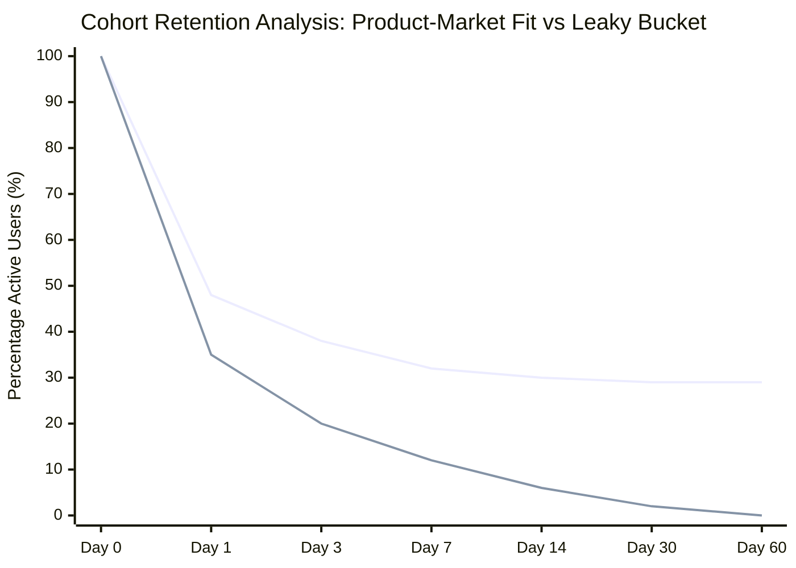

# BAB-10-Growth-UX-Product-Analytics-dan-Post-Launch-Optimizatio: Quiz, Challenge, & Knowledge Check

Dokumen evaluasi mandiri ini dirancang untuk menguji pemahaman mendalam seputar Growth UX, Product Analytics, instrumentasi event tracking, eksperimentasi A/B testing terukur, cohort retention analysis, hingga optimasi paska rilis (post-launch optimization).

---

## Bagian 1: Basic Questions (5 Soal)

### Pertanyaan 1
**Apa perbedaan mendasar antara vanity metrics dan actionable metrics dalam konteks Growth UX dan Product Analytics? Berikan contoh konkret untuk keduanya.**

#### Jawaban & Analisis Teknis
* **Vanity Metrics**: Metrik permukaan yang terlihat impresif secara angka absolut tetapi tidak mencerminkan nilai bisnis riil, retensi, atau kesehatan produk jangka panjang. Metrik ini mudah dimanipulasi dan tidak memberikan arahan kausalitas tindakan tim desain/produk.
  * *Contoh*: Total akun terdaftar (cumulative registered users), total page views, jumlah unduhan aplikasi secara kumulatif.
* **Actionable Metrics**: Metrik berbasis perilaku (behavioral) yang secara langsung menghubungkan interaksi user dengan value realization, retensi, serta performa pendapatan/konversi. Perubahan pada metrik ini langsung mengarahkan keputusan iterasi produk.
  * *Contoh*: Persentase Day-7/Day-30 Retention rate, activation rate (user yang menyelesaikan critical path dalam 24 jam pertama), conversion rate per step funnel checkout.

---

### Pertanyaan 2
**Jelaskan konsep "Aha! Moment" dalam user onboarding dan bagaimana korelasinya dengan North Star Metric (NSM) suatu produk.**

#### Jawaban & Analisis Teknis
* **Aha! Moment**: Titik krusial psikologis di mana pengguna baru pertama kali menyadari, merasakan, dan memperoleh nilai inti (*core value proposition*) produk secara langsung (contoh klasik Slack: tim yang mengirimkan 2.000 pesan; Facebook: menambahkan 7 teman dalam 10 hari).
* **Korelasi dengan North Star Metric (NSM)**: NSM mengukur nilai utama yang dirasakan pelanggan dan pertumbuhan bisnis inti secara agregat (misal: *Weekly Active Collaborative Documents* untuk Figma). Tim Growth mendesain jalur orientasi (*onboarding path*) agar Time-to-Value (TTV) ditekan serendah mungkin, mempercepat user menyentuh Aha! Moment, yang secara kausal meningkatkan probabilitas user berkontribusi aktif terhadap NSM dalam jangka panjang.

---

### Pertanyaan 3
**Dalam instrumentasi analitik produk (misalnya menggunakan Segment, Amplitude, atau Mixpanel), apa perbedaan antara Track Event dan Identify Call, serta mengapa pemisahan data ini fundamental?**

#### Jawaban & Analisis Teknis
* **Identify Call (`analytics.identify(userId, traits)`):** Digunakan untuk mengasosiasikan identitas unik user (*user ID*) dan atribut statis atau semi-statis (*user traits* / properties), seperti email, role organisasi, paket subscription, tanggal pendaftaran.
* **Track Event (`analytics.track(eventName, properties)`):** Digunakan untuk merekam aksi perilaku spesifik diskret pada titik waktu tertentu (*timestamped actions*) beserta konteks kejadiannya (*event properties*), seperti `Checkout Step Completed` dengan property `step_number: 2`, `payment_method: "gopay"`.
* **Urgensi Pemisahan:** Pemisahan ini menjaga skema database event tetap bersih (*normalized*). Atribut user tidak perlu diduplikasi redundan pada setiap payload event diskret, dan perubahan status user (misal upgrade tier) otomatis terhubung ke seluruh histori event masa lalu dan masa depan via resolusi identitas (*identity resolution*).

---

### Pertanyaan 4
**Mengapa Minimum Detectable Effect (MDE) dan Sample Size Calculation wajib dihitung sebelum menjalankan A/B testing di lingkungan produksi?**

#### Jawaban & Analisis Teknis
* Jika eksperimen dijalankan tanpa perhitungan *sample size* dan *statistical power* (biasanya 80%) serta tingkat signifikansi ($\alpha = 0.05$):
  1. **Risiko False Positive (Type I Error):** Mendeklarasikan varian baru menang padahal perbedaan murni fluktuasi acak (noise).
  2. **Risiko False Negative (Type II Error):** Menghentikan eksperimen prematur dan membuang ide fitur valid karena sampel belum cukup untuk mendeteksi deviasi kecil namun bermakna (*underpowered test*).
  3. **Praktek "Peeking Problem":** Memeriksa p-value setiap hari dan menghentikan pengujian saat p-value menyentuh angka 0.049 secara temporer merusak integritas metodologi frequentist hypothesis testing.

---

### Pertanyaan 5
**Apa perbedaan antara Unbounded Retention dan N-Day (Bracketed) Retention dalam analisis cohort analitik? Kapan masing-masing digunakan?**

#### Jawaban & Analisis Teknis
* **N-Day Retention (Strict Bracket):** Mengukur persentase pengguna dalam cohort yang kembali dan melakukan aksi spesifik tepat pada hari ke-N (misal hari ke-7 atau ke-30). Metrik ini esensial untuk aplikasi dengan kebiasaan penggunaan harian konstan (*daily cadence*), seperti media sosial, game kasual, atau aplikasi perpesanan.
* **Unbounded Retention (Rolling Retention):** Mengukur persentase pengguna yang kembali pada hari ke-N *atau hari mana pun setelahnya*. Metrik ini ideal untuk produk yang memiliki frekuensi penggunaan periodik/musiman (*weekly/monthly cadence*), seperti aplikasi reservasi hotel, e-commerce kebutuhan bulanan, atau software invoicing pajak.

---

## Bagian 2: Intermediate Questions (5 Soal)

### Pertanyaan 6
**Jelaskan trade-off teknis dan UX antara Client-side Feature Flagging versus Server-side Feature Flagging dalam pelaksanaan A/B test pada aplikasi web frontend modern.**

#### Jawaban & Analisis Teknis
* **Client-side Feature Flagging (SDK dieksekusi di browser):**
  * *Trade-off Positif:* Cepat diimplementasikan oleh tim desain frontend, tidak membebani komputasi origin server, integrasi instan dengan analitik client.
  * *Trade-off Negatif:* Rawan terjadi *Layout Shift* / *Flickering effect* (Flash of Unstyled Content/Variant) saat varian dimuat setelah render awal, payload bundle JavaScript bertambah besar, dan berpotensi membocorkan varian fitur rahasia di inspect element.
* **Server-side Feature Flagging (SDK dieksekusi di Edge/Node/Server Backend):**
  * *Trade-off Positif:* Zero layout shift (HTML disajikan ke browser sudah dalam kondisi varian ter-render sempurna / SSR), kontrol keamanan tinggi, tidak ada beban komputasi/latency ekstra di device user.
  * *Trade-off Negatif:* Membutuhkan penanganan caching edge yang kompleks (misal cookie-based cache busting di Cloudflare/Fastly), ketergantungan koordinasi lintas tim dengan backend engineers.

---

### Pertanyaan 7
**Bagaimana mendiagnosis "Novelty Effect" dalam eksperimen Growth UX, dan apa strategi mitigasi yang harus diterapkan sebelum melakukan rollout fitur secara permanen?**

#### Jawaban & Analisis Teknis
* **Diagnosa Novelty Effect:** Terjadi ketika varian baru memperlihatkan spike metrik konversi/interaksi yang sangat tinggi pada 3-7 hari pertama hanya karena elemen visual tersebut baru dan mencolok (curiosity click), namun perlahan menurun kembali ke level baseline (atau bahkan lebih buruk) setelah beberapa minggu.
* **Strategi Mitigasi:**
  1. *Segmentasi Cohort Pengguna Baru vs Pengguna Lama:* Analisis konversi secara terisolasi pada cohort *brand-new users* (yang tidak pernah melihat versi kontrol lama) vs *existing users*. Jika lonjakan hanya terjadi pada *existing users* dan menyusut seiring waktu, novelty bias terkonfirmasi.
  2. *Memperpanjang Durasi Eksperimen:* Jangan menghentikan pengujian segera setelah signifikansi statistik awal tercapai; pertahankan uji coba minimal 2 siklus bisnis penuh (minimal 14-28 hari).
  3. *Holdout Grouping:* Mengalokasikan 5-10% holdout group jangka panjang untuk memantau apakah gain tetap stabil setelah 60-90 hari.

---

### Pertanyaan 8
**Dalam Product-Led Growth (PLG), apa peran Activation Funnel friction audit dan bagaimana membedakan antara "Good Friction" versus "Bad Friction"?**

#### Jawaban & Analisis Teknis
* **Bad Friction:** Hambatan kognitif atau teknis yang tidak memberikan nilai bagi pengguna maupun produk, melainkan memperlambat pencapaian Aha! Moment.
  * *Contoh*: Form registrasi 12 kolom wajib sebelum bisa melihat dashboard, verifikasi email berlapis sebelum mencoba core preview, navigasi labirin tanpa panduan.
* **Good Friction (Value-Adding Friction):** Friksi yang sengaja didesain untuk meningkatkan personalisasi, persepsi nilai, komitmen emosional (IKEA effect), atau kualifikasi keamanan/relevansi pengguna.
  * *Contoh*: Wizard setup 3 langkah yang menanyakan preferensi industri untuk menyajikan template relevan instan, checklist konfigurasi workspace yang meningkatkan investasi emosional, atau preview verifikasi 2FA untuk produk finansial guna membangun rasa percaya (*trust*).

---

### Pertanyaan 9
**Jelaskan metodologi "Reverse Funnel Analysis" dan bagaimana teknik ini mengungkap blind spot perilaku pengguna yang terlewatkan oleh Funnel tradisional.**

#### Jawaban & Analisis Teknis
* **Keterbatasan Traditional Funnel:** Bersifat preskriptif/linear. Product Designer mengasumsikan alur pengguna yang ideal (misal: Halaman Produk $\to$ Tambah ke Keranjang $\to$ Checkout $\to$ Bayar). Jika drop-off tinggi, desainer hanya tahu user berhenti di suatu step, namun tidak tahu ke mana mereka pergi.
* **Reverse Funnel Analysis:** Menganalisis alur secara mundur (*backward tracking*) dari titik konversi sukses (atau titik drop-off kritis), mengidentifikasi semua urutan event yang dilakukan user dalam rentang 15-30 menit sebelum event target terjadi.
* **Blind Spot yang Terungkap:**
  * Menemukan *unintended shortcuts* (misal: user lebih memilih fitur pencarian global daripada kategori menu).
  * Mengidentifikasi *looping patterns* (user mondar-mandir antara cart dan FAQ biaya ongkos kirim, menandakan ketidakjelasan transparansi kalkulasi tarif).

---

### Pertanyaan 10
**Bagaimana cara menyusun Tracking Plan (Event Taxonomy) yang scalable dan resisten terhadap data debt saat tim produk melakukan ekspansi multi-platform?**

#### Jawaban & Analisis Teknis
* **Prinsip Naming Convention:** Gunakan format baku terstandarisasi, seperti `[Object] [Action]` dalam Title Case atau snake_case konsisten (misal: `Document Created`, `Payment Option Selected`). Hindari penamaan ambigu berbasis UI semata seperti `red_button_clicked`.
* **Standardisasi Global vs Local Properties:**
  * *Global / Context Properties:* Otomatis di-inject oleh SDK Wrapper (`app_version`, `platform`, `session_id`, `locale`, `network_type`).
  * *Local Context Properties:* Eksklusif untuk event bersangkutan (misal: `document_type`, `template_id`).
* **Governance & Type Safety:** Menggunakan Schema Registry (seperti Avo atau Segment Protocols) yang terintegrasi dengan CI/CD pipeline atau code-gen TypeScript/Swift/Kotlin interface, sehingga jika developer mengirim payload yang melanggar tipe data, build test akan otomatis *fail*.

---

## Bagian 3: Skenario Kasus Nyata Produksi (3 Skenario)

### Skenario 1: Drop-off Kritis 68% pada Langkah KYC Fintech B2B
* **Konteks:** Sebuah aplikasi B2B Invoice Factoring mengalami tingkat konversi registrasi ke aktivasi akun yang rendah. Dari total registrasi baru, 68% pengguna gugur pada langkah unggah dokumen legalitas (SIUP, NIB, & KTP Direktur) di step onboarding ke-3.
* **Problem Statement:** User merasa terintimidasi oleh permintaan dokumen sensitif sebelum mendapatkan verifikasi kelayakan limit pendanaan awal, menyebabkan friction tinggi dan persepsi risiko sepihak.
* **Analisis Data & User Research:**
  * Mixpanel Funnel menunjukkan 72% sesi berhenti di input file NIB.
  * Heatmap & Session Replay (Hotjar/FullStory) menunjukkan user membuka tab kalkulator dan tab FAQ, kemudian keluar (*rage exits*).
  * Qualitative interview: Pengguna ragu membagikan dokumen legal karena mereka tidak tahu apakah perusahaan mereka akan disetujui atau berapa estimasi limit pinjaman yang bisa didapat.
* **Action Plan & Implementasi Growth UX:**
  1. *Progressive Disclosure & Re-ordering Funnel:* Pindahkan kalkulator estimasi limit ke langkah awal (zero login friction). User memasukkan omzet rata-rata dan sektor industri untuk mendapatkan "Estimasi Limit Pre-Approval".
  2. *Value Preceding Ask:* Berikan janji nilai konkret sebelum meminta dokumen: *"Unggah NIB untuk mengunci bunga promosi 0.8% dan limit Rp 500.000.000 Anda"*.
  3. *In-line Validation & Camera Scanner:* Berikan feedback instan resolusi dokumen dan deteksi otomatis kualitas gambar menggunakan OCR di browser untuk memangkas error upload.
* **Metrik Keberhasilan:** Kenaikan Completion Rate onboarding minimal +25%, pemangkasan Drop-off di step legalitas dari 68% menjadi <35%, serta peningkatan D-14 Active Borrowers.

---

### Skenario 2: Fitur Baru Kolaborasi SaaS Diabaikan (Zero Feature Discovery)
* **Konteks:** Tim Engineering meluncurkan fitur "Real-time Canvas Annotation" pada aplikasi manajemen proyek B2B setelah 3 bulan development. Namun, dashboard PostHog menunjukkan hanya 2.3% dari Weekly Active Users (WAU) yang pernah mengklik tombol tersebut dalam 30 hari pertama pasca peluncuran.
* **Problem Statement:** Fitur diletakkan di dalam nested sub-menu dropdown ("Actions > More Tools > Annotate"), dan promosi rilis hanya mengandalkan banner *What's New* modal pop-up generik yang ditutup oleh 89% user dalam kurun 1.2 detik.
* **Analisis Data & Perilaku:**
  * Event `whats_new_modal_dismissed` mendominasi.
  * User path menunjukkan 90% waktu dihabiskan di visual task board tanpa membuka sub-menu navigasi tambahan.
  * Analisis korelasi: User yang secara tidak sengaja menemukan dan memakai fitur ini memiliki retensi 3x lipat dibanding user biasa, menandakan nilai fiturnya tinggi namun kemampuan penemuannya (*discoverability*) nol.
* **Action Plan & Growth Loops:**
  1. *Contextual In-Situ Prompting (Just-in-Time Nudge):* Hapus modal pop-up global. Pasang tooltip kontekstual mikro tepat ketika user mengunggah file attachment gambar: *"Ingin memberi feedback langsung di gambar? Coba klik ikon pena di atas gambar ini"*.
  2. *Multiplayer Viral Loop:* Ketika seorang user meninggalkan anotasi, sistem mengirimkan mention notification interaktif ke rekan satu tim: *"Budi menambahkan 3 catatan pada desain Anda"*. Klik pada link langsung membuka canvas interaktif dengan mode fokus.
* **Metrik Keberhasilan:** Adopsi fitur melonjak dari 2.3% menjadi minimal 18% WAU dalam 4 minggu, dengan peningkatan metrik kolaborasi tim (Comments & Annotations per Project).

---

### Skenario 3: Subscription Churn Spike Pasca Pengurangan Periode Free Trial
* **Konteks:** Platform EdTech SaaS mengubah durasi Free Trial dari 14 hari menjadi 7 hari guna mempercepat cash flow. Dampaknya, Free-to-Paid Conversion anjlok 32%, dan keluhan pengembalian dana (*refund requests*) melonjak 40% akibat sistem auto-charge kartu kredit yang mengejutkan pengguna.
* **Problem Statement:** Pemangkasan durasi menjadi 7 hari tidak memberi ruang waktu yang cukup bagi pengguna untuk mencapai *Habit Loop* dan mengonsumsi minimal 3 modul materi pembelajaran. Pengguna merasa "dijebak" (*dark pattern perception*).
* **Analisis Cohort & Behavioral Funnel:**
  * Analisis data survival curve menunjukkan median waktu yang dibutuhkan user untuk menyelesaikan modul pertama adalah 5.2 hari.
  * Pada siklus 7 hari, 61% user baru menyelesaikan 1 modul saat email peringatan penagihan dikirim, sehingga perceived value masih sangat rendah.
* **Action Plan & Win-back UX:**
  1. *Usage-Triggered Trial Extension:* Buat mekanik gamifikasi transparan: *"Selesaikan Modul 2 sebelum Hari ke-6 untuk mendapatkan perpanjangan trial gratis 7 hari tambahan"*. Ini menyelaraskan insentif bisnis dengan aktivasi materi.
  2. *Anti-Surprise Billing Notice:* Pasang email dan in-app notification transparan di Hari ke-5: *"Trial Anda berakhir dalam 48 jam. Berikut rangkuman materi yang sudah Anda pelajari dan sertifikat yang bisa Anda raih jika melanjutkan"*, dilengkapi tombol one-click pause/cancel tanpa rintangan manipulatif.
  3. *Exit Intent Downsell:* Jika user membatalkan, tawarkan opsi "Pause subscription 30 hari" atau paket mikro modular yang lebih hemat.
* **Metrik Keberhasilan:** Pemulihan Free-to-Paid Conversion rate ke angka baseline semula (+30% recovery), penurunan komplain chargeback/refund sebesar >60%, dan peningkatan retensi Month-3 pelanggan berbayar.

---

## Bagian 4: Practical Chapter Challenge (1 Tantangan Hands-On)

### Judul Tantangan: Desain Arsitektur Instrumentasi Event Tracking & Eksperimen A/B Onboarding E-Commerce

#### Deskripsi & Latar Belakang
Anda ditunjuk sebagai Lead Growth UX Designer di sebuah platform marketplace C2C. Aplikasi memiliki alur onboarding bagi pembeli pertama kali (*first-time buyers*) yang ingin melakukan transaksi pertama dengan voucher promo "DISKONPERDANA".

#### Deliverables yang Wajib Dibuat:
1. **Tracking Plan Matrix (Tabel Markdown):**
   * Susun minimal 6 event krusial pada alur dari landing screen hingga `Order Payment Completed`.
   * Tentukan untuk setiap event: `Event Name`, `Trigger Condition`, `Platform (Web/App)`, serta `Event Properties` beserta tipe datanya.
2. **Desain Hipotesis Eksperimen A/B:**
   * Tuliskan rumusan hipotesis ilmiah dengan format: *"Jika [perubahan UX/desain], maka [dampak metrik spesifik], karena [alasan psikologis/perilaku user]"*.
   * Definisikan Control (Varian A) vs Treatment (Varian B).
   * Tentukan:
     * **Primary Metric** (Evaluasi kemenangan)
     * **Secondary Metrics** (Dampak sampingan positif)
     * **Guardrail Metrics** (Metrik pengaman yang tidak boleh rusak, misal return rate atau support tickets)
3. **Grafik Rencana Retensi Cohort (ASCII atau Mermaid Diagram):**
   * Visualisasikan perbandingan kurva retensi ideal (*flattening curve*) versus kurva retensi buruk (*decaying to zero*).

---

### Solusi Referensi & Rubrik Penilaian Challenge

#### 1. Tracking Plan Matrix
| Event Name | Trigger Condition | Platform | Event Properties & Types |
| :--- | :--- | :--- | :--- |
| `Onboarding Step Viewed` | Saat layar tahapan orientasi dibuka oleh user | iOS, Android, Web | `step_index: Integer`, `step_name: String`, `total_steps: Integer` |
| `Promo Voucher Claimed` | User mengklik CTA klaim voucher DISKONPERDANA | iOS, Android, Web | `voucher_code: String`, `discount_value: Number`, `campaign_source: String` |
| `Product Search Executed` | User mengirim query pencarian barang | iOS, Android, Web | `query: String`, `category_filter: String`, `results_count: Integer` |
| `Product Added to Cart` | Klik tombol "Tambah ke Keranjang" | iOS, Android, Web | `product_id: String`, `seller_id: String`, `price: Number`, `has_active_voucher: Boolean` |
| `Checkout Flow Started` | Klik tombol "Checkout" dari keranjang | iOS, Android, Web | `cart_total_value: Number`, `total_items: Integer`, `applied_voucher_code: String` |
| `Order Payment Completed` | Server mengonfirmasi status pembayaran lunas | Backend / Webhook | `order_id: String`, `payment_method: String`, `net_revenue: Number`, `is_first_order: Boolean` |

#### 2. Desain Hipotesis Eksperimen A/B
* **Pernyataan Hipotesis:**
  *"Jika kita menampilkan voucher DISKONPERDANA langsung terpasang secara otomatis (*auto-applied*) pada banner ringkasan checkout pembeli baru tanpa mengharuskan input kode manual di kolom promo, maka **First-time Checkout Completion Rate** akan meningkat minimal +15%, karena mengeliminasi friksi ingatan kognitif (*memory retrieval strain*) dan mencegah user meninggalkan aplikasi untuk mencari kode promo di platform eksternal."*
* **Desain Varian:**
  * *Control (Varian A):* Kolom input promo konvensional kosong dengan teks placeholder "Masukkan Kode Promo".
  * *Treatment (Varian B):* Widget voucher terpasang otomatis dengan kartu visual eviden hemat biaya: *"Voucher Pengguna Baru Otomatis Aktif: Anda Hemat Rp 25.000"*.
* **Struktur Metrik:**
  * *Primary Metric:* First-time Buyer Checkout Conversion Rate (`Checkout Flow Started` $\to$ `Order Payment Completed`).
  * *Secondary Metrics:* Average Time-to-Purchase (menit sejak install hingga bayar), persentase pemakaian voucher selamat datang.
  * *Guardrail Metrics:* Average Order Value (AOV) tidak boleh turun >5%, dan tingkat komplain pelanggan terkait kesalahan kalkulasi voucher harus <0.1%.

#### 3. Visualisasi Kurva Retensi (Mermaid Chart)

*(Keterangan: Garis atas mendatar secara paralel menandakan produk memiliki retensi stabil / Product-Market Fit; garis bawah yang terus menyusut mendekati nol menandakan kebocoran corong / leaky bucket).*

---

## Bagian 5: Checklist Pemahaman Mandiri

Berikan tanda centang `[x]` jika Anda telah menguasai kompetensi teknis berikut:

- [ ] **Fondasi & Metrik Growth:** Mampu membedakan secara kritis antara Vanity Metrics, Actionable Metrics, Output Metrics, dan North Star Metric (NSM) yang tepat sasaran.
- [ ] **Framework & Funnel:** Menguasai implementasi praktis Pirate Metrics (AARRR) dan Heart Framework serta mampu membedakan alur aktivasi *Good Friction* vs *Bad Friction*.
- [ ] **Skema Analitik & Instrumentasi:** Mampu menyusun Event Taxonomy (Tracking Plan) yang konsisten, aman, dan scalable menggunakan konvensi Object-Action serta memisahkan *Identify Traits* dari *Track Event Properties*.
- [ ] **Metodologi Eksperimentasi (A/B Testing):** Memahami kalkulasi Sample Size, MDE, p-value, Statistical Power (1 - $\beta$), risiko peeking, serta cara mendiagnosis Novelty Effect pada fase post-launch.
- [ ] **Cohort & Retention Dynamics:** Mampu menganalisis Retention Curve, membedakan N-day Retention vs Unbounded Retention, serta merancang loop retensi berbasis pemicu intrinsik dan ekstrinsik.
- [ ] **Post-Launch Optimization & Governance:** Mampu melakukan Root Cause Analysis pada funnel drop-off melalui triangulasi data kuantitatif (event logs, drop-off rate) dan data kualitatif (session replay, heatmap, feedback prompt).
