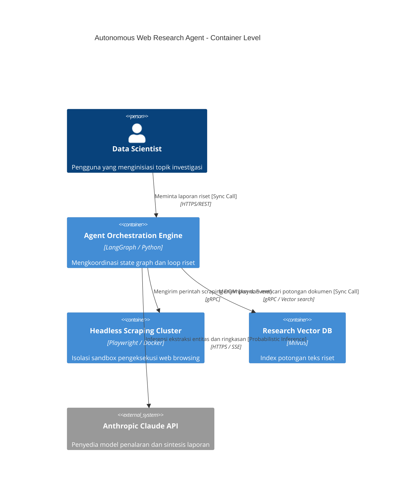

# Bab 07: Prinsip Komunikasi Visual & Diagram C4 Model

## 1. Learning Objectives
Setelah menyelesaikan bab ini, Anda diharapkan mampu:
- **Menganalisis** beban kognitif (*cognitive load*) pada dokumentasi teknis sistem kecerdasan buatan (*Artificial Intelligence/AI*) dan agen otonom menggunakan prinsip-prinsip psikologi Gestalt.
- **Mengembangkan** taksonomi diagram arsitektur berlapis menggunakan *C4 Model* (Context, Containers, Components, Code) yang disesuaikan secara spesifik untuk sistem AI non-deterministik, *orchestration layer*, dan penyimpanan data vektor.
- **Merancang** representasi visual standar industri untuk topologi agen otonom (*Autonomous Agent Swarms*), mencakup batasan sistem (*system boundaries*), antarmuka alat (*tool interfaces*), serta siklus *action-perception*.
- **Mengimplementasikan** pendekatan *Diagrams-as-Code* (DaC) berbasis Python dan validasi skema metamodel C4 guna menjamin sinkronisasi otomatis antara kode sumber arsitektur dan artefak visual di *pipeline* CI/CD.
- **Mengevaluasi** mitigasi *failure modes* visual, seperti *visual clutter*, representasi *non-deterministic loop*, dan ketidaksesuaian semantik relasi dependensi pada sistem terdistribusi.

---

## 2. Concept Overview
Komunikasi visual dalam rekayasa perangkat lunak bukan sekadar pelengkap estetika, melainkan instrumen transmisi informasi teknis berdensitas tinggi dengan distorsi minimal. Pada ranah agen otonom dan sistem data AI, kompleksitas sistem meningkat secara eksponensial karena adanya sifat **non-deterministik**, **eksekusi rekursif**, dan **ketergantungan *runtime* yang dinamis**.

```
+-----------------------------------------------------------------------+
|                    Prinsip Komunikasi Visual                          |
|  - Gestalt Psychology (Proximity, Similarity, Continuity, Closure)    |
|  - Cognitive Load Theory (Intrinsic, Germane, Extraneous)            |
+-----------------------------------------------------------------------+
                                    |
                                    v
+-----------------------------------------------------------------------+
|                         C4 Abstraction Layers                         |
|  [L1] System Context  : Pengguna, Ekosistem AI, Batasan Sistem        |
|  [L2] Containers      : LLM Runtime, Vector DB, Message Broker, UI    |
|  [L3] Components      : Prompt Engine, Guardrails, Memory Retriever   |
|  [L4] Code / Dynamic  : Agent State-Graph, Execution DAG              |
+-----------------------------------------------------------------------+
                                    |
                                    v
+-----------------------------------------------------------------------+
|                     Diagrams-as-Code Pipeline                         |
|  Pydantic Metamodel -> Structural Validation -> PlantUML/Mermaid/SVG  |
+-----------------------------------------------------------------------+
```

### 2.1 Teori Komunikasi Visual & Ergonomi Kognitif
Penyampaian arsitektur sistem kepada *stakeholder* lintas disiplin (peneliti ML, *platform engineer*, *security auditor*) didasari oleh tiga pilar teori kognitif:

1. **Hukum Gestalt**:
   - **Proximity (Kedekatan)**: Komponen yang diletakkan berdekatan diasumsikan berada dalam domain komputasi atau modul yang sama (misal: kluster instans *embedding worker* di dalam *VPC boundary*).
   - **Similarity (Kesamaan)**: Entitas dengan fungsi setara (misal: semua model fondasi *third-party*) harus mempertahankan bentuk geometris, warna, dan tipografi yang seragam.
   - **Closure & Enclosure (Penutupan/Batas)**: Penggunaan *bounding boxes* untuk membatasi konteks (misal: *boundary* antara *Trusted Agent Execution Zone* dan *Untrusted External Web Sandbox*).

2. **Cognitive Load Theory (Sweller)**:
   - **Intrinsic Load**: Kompleksitas intrinsik dari arsitektur multi-agen (tidak dapat dihilangkan, namun dapat dibagi ke beberapa tingkat abstraksi).
   - **Extraneous Load**: Hambatan mental yang timbul akibat diagram yang buruk (panah bersilangan, ketiadaan label protokol, ikonografi yang ambigu). Harus dieliminasi.
   - **Germane Load**: Beban komputasi mental yang membantu pemahaman pola sistem (ditingkatkan melalui konsistensi notasi dan hierarki abstraksi yang logis).

### 2.2 Taksonomi C4 Model untuk AI & Sistem Otonom
C4 Model (diciptakan oleh Simon Brown) menyediakan hierarki abstraksi bertingkat guna memetakan sistem perangkat lunak. Namun, penerapannya pada domain agen otonom memerlukan adaptasi semantik khusus:

- **Level 1: System Context**:
  Mendefinisikan lanskap interaksi antara aktor manusia (misal: *Data Analyst*), sistem agen otonom sebagai satu kesatuan kotak hitam (*black-box system*), dan sistem eksternal (penyedia model LLM, API perbankan warisan, data warehouse).
- **Level 2: Container (Bukan sekadar Docker)**:
  Menggambarkan unit perangkat lunak yang dapat dideploy dan dieksekusi secara independen. Dalam konteks AI, mencakup: *Orchestration Engine* (misal: temporal *runtime* atau LangGraph *server*), *Inference Microservices* (vLLM/TGI), *Vector Storage Engine* (Qdrant/Milvus), dan *Relational Audit Log Store*.
- **Level 3: Component**:
  Mengurai isi *container* ke dalam modul-modul struktural kode: *Semantic Cache Controller*, *Agent Reflection Loop*, *Context Compressor*, *Tool Executor*, dan *Output Guardrails Engine*.
- **Level 4: Code / Dynamic / Execution Graph**:
  Pada sistem perangkat lunak klasik, level ini sering memvisualisasikan *UML Class Diagram*. Namun, dalam konteks agen otonom, Level 4 lebih bernilai saat merepresentasikan **Directed Acyclic Graphs (DAG)** atau **State Graphs** yang mengatur alur inferensi, penalaran (*ReAct/Plan-and-Solve*), serta jalur fallback antar-agen.

---

## 3. Why It Matters
Dokumentasi visual untuk arsitektur AI modern kerap mengalami degradasi akibat penggunaan diagram bergaya "arsitektur awan acak" (*ad-hoc box-and-arrow*) yang sarat ambiguitas teknis. Kegagalan visualisasi ini menimbulkan risiko sistemik pada implementasi enterprise:

1. **Ilusi Simplisitas Non-Deterministik**:
   Diagram informal sering merepresentasikan agen sebagai lingkaran tunggal bertuliskan "AI Agent" dengan panah dua arah menuju "Database". Representasi ini menyembunyikan risiko fatal: ketidakjelasan mekanisme *state management*, ketiadaan pemisahan *plane* inferensi dan *control plane*, serta hilangnya batasan keamanan (*trust boundaries*) saat agen mengeksekusi *dynamic code execution*.

2. **Fragmentasi Paradigma Antar Tim**:
   *Machine Learning Engineers* cenderung memetakan alur komputasi data (*tensors*, *embeddings*), sementara *Infrastructure Engineers* fokus pada *Kubernetes pods*, *ingress*, dan *egress network policies*. Framework C4 menjembatani kedua perspektif tersebut dalam satu kerangka kerja visual hierarkis yang koheren.

3. **Kepatuhan Regulasi & Auditabilitas (EU AI Act, SOC2)**:
   Sistem AI otonom tunduk pada kewajiban audit yang ketat terkait intervensi manusia (*Human-in-the-loop/HITL*) dan isolasi data sensitif (PII). Diagram Context dan Container C4 yang terstruktur secara eksplisit memperlihatkan titik intervensi manual, mitigasi eksfiltrasi data, dan jalur audit trail deterministik.

---

## 4. Arsitektur & Diagram Komponen
Berikut adalah pemetaan struktural 4 tingkat abstraksi C4 Model untuk sebuah sistem **Enterprise Autonomous Financial Audit Agent**:

```
====================================================================================================
LEVEL 1: SYSTEM CONTEXT DIAGRAM (Auditor Environment)
====================================================================================================
                        +-----------------------------+
                        |     Compliance Auditor      |
                        |          [Person]           |
                        +-----------------------------+
                                       |
                   1. Submits Financial Audits & Reviews
                                       v
+--------------------------------------------------------------------------------------------------+
|                            Enterprise Financial Agent System [Software System]                   |
|  Sistem AI otonom untuk rekonsiliasi anomali transaksi buku besar dan deteksi fraud keuangan.    |
+--------------------------------------------------------------------------------------------------+
          |                                      |                                   |
2. LLM Inference Queries            3. Fetch Ledger Records             4. Emits Incident Webhooks
          v                                      v                                   v
+--------------------+               +-----------------------+              +----------------------+
| OpenRouter / Azure |               | Core Banking Database |              | Slack / PagerDuty    |
|   OpenAI Cluster   |               |     (Mainframe DB2)   |              |  Notification Engine |
| [External System]  |               |   [External System]   |              |  [External System]   |
+--------------------+               +-----------------------+              +----------------------+

====================================================================================================
LEVEL 2: CONTAINER DIAGRAM (Inside the Software System Boundary)
====================================================================================================
+--------------------------------- Enterprise Financial Agent System -------------------------------+
|                                                                                                  |
|  +--------------------+        JSON/gRPC        +---------------------------------------------+  |
|  |   API Gateway      | ----------------------> |        Agent Orchestrator Service           |  |
|  | (Kong / FastAPI)   |                         |             (Go / Python)                   |  |
|  |    [Container]     |                         |  Mengelola alur kerja, state, dan delegasi   |  |
|  +--------------------+                         |                  [Container]                |  |
|            ^                                    +---------------------------------------------+  |
|            | HTTPS/Auth                                    |                     |               |
|            |                                    SQL Queries|         gRPC Vectors|               |
|  +--------------------+                                    v                     v               |
|  | Auditor Web UI     |                         +-------------------+   +---------------------+  |
|  |  (Next.js App)     |                         | Transaction Store |   | Audit Vector Index  |  |
|  |    [Container]     |                         | (PostgreSQL 16)   |   |   (Qdrant Cluster)  |  |
|  +--------------------+                         |    [Container]    |   |     [Container]     |  |
|                                                 +-------------------+   +---------------------+  |
+--------------------------------------------------------------------------------------------------+

====================================================================================================
LEVEL 3: COMPONENT DIAGRAM (Inside the Agent Orchestrator Container)
====================================================================================================
+-------------------------------- Agent Orchestrator Service --------------------------------------+
|                                                                                                  |
|   +-----------------------+           +----------------------+         +---------------------+   |
|   | Execution Controller  | --------> | Guardrail Evaluator  | ------> | Prompt & Context    |   |
|   |  - State Graph Loop   |           |  - Llama-Guard / PII |         |   Builder Engine    |   |
|   |      [Component]      |           |     [Component]      |         |     [Component]     |   |
|   +-----------------------+           +----------------------+         +---------------------+   |
|               |                                                                   |              |
|               | Tool Invocations                                                  | Inference    |
|               v                                                                   v              |
|   +-----------------------+                                            +---------------------+   |
|   | Dynamic Tool Registry |                                            | LLM Client Adapter  |   |
|   |  - SQL Runner Sandbx  |                                            |  - Retry & Circuit  |   |
|   |  - Ratio Calculator   |                                            |       Breaker       |   |
|   |      [Component]      |                                            |     [Component]     |   |
|   +-----------------------+                                            +---------------------+   |
+--------------------------------------------------------------------------------------------------+

====================================================================================================
LEVEL 4: DYNAMIC / CODE DIAGRAM (Execution Graph for ReAct Reflection Loop)
====================================================================================================
[User Goal] --> (Input Parser) 
                       |
                       v
         +---> [Planner Node] <---------------------------------------------+
         |             |                                                    |
         |      Generate Sub-Task                                           |
         |             v                                                    |
         |     [Tool Evaluator]                                             |
         |       /           \                                              |
     Deterministic        Non-Deterministic                                 |
         |                     \                                            |
         v                      v                                           |
   [Execute SQL Sandbox]   [Invoke LLM Reasoning]                           |
         \                      /                                           |
          +------------+-------+                                            |
                       |                                                    |
                       v                                                    |
             [Reflection & Critic]                                          |
                 /            \                                             |
           Is Valid?        Needs Iteration (Max Loops < 5)                 |
              /                \____________________________________________|
            Yes
             v
     [Final Audit Synthesis] --> (Return Artifact to API Gateway)
```

---

## 5. Deep Dive Mekanisme & Prinsip Kerja

### 5.1 Adaptasi Metamodel C4 untuk Paradigma Agen Otonom
Dalam sistem deterministik tradisional, panah relasi mendefinisikan *Method Invocations*, *Synchronous RPC*, atau *Asynchronous Event Subscriptions*. Pada sistem AI otonom, semantik panah harus diperluas untuk menghindari kebingungan struktural:

1. **Synchronous vs. Probabilistic Invocations**:
   - Panggilan deterministik (misal: *API Gateway* memanggil *PostgreSQL* untuk membaca status sesi) memiliki keluaran biner: *Success* atau *Failure*.
   - Panggilan model inferensi (misal: *Prompt Builder* memanggil *LLM Client Adapter*) bersifat probabilistik dengan kemungkinan degradasi struktural (halusinasi, format JSON rusak, kegagalan guardrail). Komunikasi visual wajib menyertakan anotasi penanganan kegagalan (*fallback*, *retry budget*, atau *schema repair*).

2. **The Dynamic Tool Sandbox Boundary**:
   Agen otonom sering kali memproduksi kode SQL atau kode Python secara *runtime* untuk menyelesaikan masalah. Secara visual, Level 3 C4 harus dengan tegas menunjukkan **Isolation Boundary** (misal: gVisor, WebAssembly Sandbox) antara *Agent Orchestrator* dan *Environment* di mana kode yang dihasilkan LLM tersebut dieksekusi.

3. **Separation of Cognitive State vs. Operational State**:
   - **Operational State**: Metadata pekerjaan, *rate limit quota*, dan *session tokens* (disimpan pada Redis/Postgres).
   - **Cognitive State**: *Chat history sliding window*, representasi *vector embeddings*, *episodic memory buffers*, dan *scratchpad reflection steps*. Level 2 Container C4 wajib membedakan kedua media penyimpanan ini secara visual.

### 5.2 Sintaks Visual, Tipografi, dan Tata Kelola Simbol
Guna memastikan diagram tidak ambigu (*unambiguous visual syntax*), terapkan konvensi notasi terpadu berikut:

| Elemen Diagram | Format Visual Standar | Deskripsi Semantik |
|---|---|---|
| **Person** | Siluet manusia / Kotak Aksen Gelap | Aktor eksternal yang menginisiasi atau menerima dampak langsung sistem. |
| **Software System** | Persegi panjang sudut tumpul (*Border*: solid 2px) | Batasan sistem tertinggi yang dianalisis atau sistem eksternal pendukung. |
| **Container** | Persegi panjang (*Border*: solid 1.5px) | Unit eksekusi independen (Microservice, DB, S3 Bucket, Browser App). |
| **Component** | Persegi panjang bertingkat (*Border*: dash 1px) | Modul internal kode di dalam *Container boundary*. |
| **Dynamic Execution Node** | Oval / Diamond untuk percabangan | Node pemrosesan transien dalam graf eksekusi kognitif agen. |
| **Relasi Deterministik**| Garis panah solid (`-->`) | Panggilan gRPC, HTTPS REST, direct SQL queries. |
| **Relasi Probabilistik**| Garis panah bertitik tebal (`..>`) | Inferensi model fondasi, evaluasi semantik, pencarian *k-NN*. |

---

## 6. Production-Ready Code Implementation

Berikut adalah implementasi *Diagrams-as-Code Engine* berbasis Python yang memvalidasi integritas relasi arsitektur C4 sebelum menghasilkan kode representasi visual (*Mermaid C4*). Mesin ini menerapkan validasi skema metamodel C4 via **Pydantic V2** untuk menjamin tidak terjadinya pelanggaran batasan abstraksi (*architectural boundary violation*).

```python
"""
c4_diagram_engine.py
Engine validasi dan kompilasi arsitektur berbasis Diagrams-as-Code untuk C4 Model.
Fokus: Sistem Agen Otonom dan Infrastruktur AI.
"""

from enum import Enum
from typing import List, Dict, Optional
from pydantic import BaseModel, Field, field_validator, model_validator


class ElementType(str, Enum):
    PERSON = "Person"
    SYSTEM = "Software System"
    EXTERNAL_SYSTEM = "External System"
    CONTAINER = "Container"
    COMPONENT = "Component"


class InteractionType(str, Enum):
    DETERMINISTIC_SYNC = "Sync Call"
    DETERMINISTIC_ASYNC = "Async Event"
    PROBABILISTIC_INFERENCE = "Probabilistic Inference"


class C4Element(BaseModel):
    id: str = Field(..., pattern=r"^[a-zA-Z0-9_]+$", description="Identifier unik alfanumerik")
    name: str = Field(..., min_length=2, max_length=100)
    element_type: ElementType
    description: str = Field(..., max_length=255)
    technology: Optional[str] = Field(default=None, max_length=100)
    parent_id: Optional[str] = Field(default=None, description="ID elemen induk jika berada dalam boundary")


class C4Relationship(BaseModel):
    source_id: str
    target_id: str
    description: str
    interaction_type: InteractionType
    protocol: str = Field(..., example="gRPC, HTTPS, Vector-kNN")


class C4ArchitectureModel(BaseModel):
    title: str
    elements: Dict[str, C4Element] = Field(default_factory=dict)
    relationships: List[C4Relationship] = Field(default_factory=list)

    def add_element(self, element: C4Element) -> None:
        if element.id in self.elements:
            raise ValueError(f"Elemen dengan ID '{element.id}' sudah terdaftar.")
        self.elements[element.id] = element

    def add_relationship(self, rel: C4Relationship) -> None:
        if rel.source_id not in self.elements:
            raise KeyError(f"Source ID '{rel.source_id}' tidak ditemukan dalam metamodel.")
        if rel.target_id not in self.elements:
            raise KeyError(f"Target ID '{rel.target_id}' tidak ditemukan dalam metamodel.")
        self.relationships.append(rel)

    @model_validator(mode="after")
    def validate_c4_hierarchy_rules(self) -> "C4ArchitectureModel":
        """
        Validasi batas abstraksi arsitektural:
        - Komponen tidak boleh berhubungan langsung dengan elemen di luar Kontainer induknya,
          kecuali melalui Container adapter.
        """
        for rel in self.relationships:
            src = self.elements[rel.source_id]
            tgt = self.elements[rel.target_id]

            if src.element_type == ElementType.COMPONENT and tgt.element_type == ElementType.EXTERNAL_SYSTEM:
                raise ValueError(
                    f"Pelanggaran C4: Komponen '{src.name}' tidak boleh memanggil "
                    f"External System '{tgt.name}' secara langsung. Gunakan Container Adapter!"
                )
        return self

    def export_to_c4_mermaid(self) -> str:
        """
        Melakukan serialisasi metamodel internal ke dalam sintaks Mermaid C4.
        """
        lines = [
            "%% Generated by C4 Architecture Engine (AI Systems Focus)",
            "C4Context",
            f"    title {self.title}",
            "",
        ]

        # Render Elemen
        for el in self.elements.values():
            tech = f", \"{el.technology}\"" if el.technology else ""
            if el.element_type == ElementType.PERSON:
                lines.append(f'    Person({el.id}, "{el.name}", "{el.description}")')
            elif el.element_type == ElementType.SYSTEM:
                lines.append(f'    System({el.id}, "{el.name}", "{el.description}")')
            elif el.element_type == ElementType.EXTERNAL_SYSTEM:
                lines.append(f'    System_Ext({el.id}, "{el.name}", "{el.description}")')
            elif el.element_type == ElementType.CONTAINER:
                lines.append(f'    Container({el.id}, "{el.name}"{tech}, "{el.description}")')
            elif el.element_type == ElementType.COMPONENT:
                lines.append(f'    Component({el.id}, "{el.name}"{tech}, "{el.description}")')

        lines.append("")
        
        # Render Relasi
        for rel in self.relationships:
            label = f"{rel.description} [{rel.interaction_type.value}]"
            lines.append(f'    Rel({rel.source_id}, {rel.target_id}, "{label}", "{rel.protocol}")')

        return "\n".join(lines)


# =====================================================================
# Eksekusi Pembentukan Arsitektur Multi-Agent RAG
# =====================================================================
if __name__ == "__main__":
    try:
        # 1. Inisialisasi Model
        arch = C4ArchitectureModel(title="Topologi Sistem Agen Audit Keuangan Otonom")

        # 2. Definisikan Level Context & Container Elements
        auditor = C4Element(
            id="auditor",
            name="Auditor Internal",
            element_type=ElementType.PERSON,
            description="Personel kepatuhan yang memvalidasi rekonsiliasi anomali"
        )
        
        agent_orchestrator = C4Element(
            id="agent_orchestrator",
            name="Agent Orchestration Service",
            element_type=ElementType.CONTAINER,
            description="Eksekusi LangGraph state machine dan evaluasi guardrail",
            technology="Python 3.11 / FastAPI"
        )

        vector_db = C4Element(
            id="vector_db",
            name="Semantic Vector Index",
            element_type=ElementType.CONTAINER,
            description="Penyimpanan representasi dense embedding dokumen audit",
            technology="Qdrant Distributed"
        )

        llm_gateway = C4Element(
            id="llm_gateway",
            name="Azure OpenAI Endpoint",
            element_type=ElementType.EXTERNAL_SYSTEM,
            description="Cluster inferensi model fondasi eksternal",
            technology="HTTPS REST API"
        )

        # Registrasi Elemen
        arch.add_element(auditor)
        arch.add_element(agent_orchestrator)
        arch.add_element(vector_db)
        arch.add_element(llm_gateway)

        # 3. Definisikan Relasi Struktural
        arch.add_relationship(C4Relationship(
            source_id="auditor",
            target_id="agent_orchestrator",
            description="Mengirim instruksi investigasi",
            interaction_type=InteractionType.DETERMINISTIC_SYNC,
            protocol="HTTPS/JSON"
        ))

        arch.add_relationship(C4Relationship(
            source_id="agent_orchestrator",
            target_id="vector_db",
            description="Mengambil histori audit serupa via k-NN",
            interaction_type=InteractionType.DETERMINISTIC_SYNC,
            protocol="gRPC"
        ))

        arch.add_relationship(C4Relationship(
            source_id="agent_orchestrator",
            target_id="llm_gateway",
            description="Inferensi penalaran ReAct loop",
            interaction_type=InteractionType.PROBABILISTIC_INFERENCE,
            protocol="HTTPS / SSE"
        ))

        # 4. Generate Mermaid Output
        mermaid_output = arch.export_to_c4_mermaid()
        print("=== COMPILATION SUCCESS: MERMAID C4 OUTPUT ===")
        print(mermaid_output)

        # 5. Uji Coba Pelanggaran Arsitektur (Failure Mode Test)
        print("\n=== VALIDASI DETEKSI PELANGGARAN ARSITEKTUR ===")
        faulty_component = C4Element(
            id="prompt_template_comp",
            name="Prompt Template Parser",
            element_type=ElementType.COMPONENT,
            description="Parser internal prompt",
            technology="Python Class"
        )
        arch.add_element(faulty_component)
        
        # Mencoba menghubungkan Component langsung ke External System
        arch.add_relationship(C4Relationship(
            source_id="prompt_template_comp",
            target_id="llm_gateway",
            description="Ilegal direct access",
            interaction_type=InteractionType.PROBABILISTIC_INFERENCE,
            protocol="HTTPS"
        ))
        
        # Validasi model ulang (pemicu error)
        arch.validate_c4_hierarchy_rules()

    except (ValueError, KeyError) as e:
        print(f"[BLOCKED BY ARCHITECTURE LINTER]: {e}")
```

---

## 7. Edge Cases & Failure Modes

Visualisasi arsitektur sistem berbasis data dan agen otonom rentan terhadap serangkaian kegagalan penyampaian informasi teknis (*visual failure modes*):

| Failure Mode | Mekanisme Penyebab | Manifestasi dalam Arsitektur AI | Strategi Mitigasi Terstruktur |
|---|---|---|---|
| **Loop Explosion / Graph Clutter** | Visualisasi siklus refleksi (*agent retry loop*) digambar secara repetitif pada satu diagram statis. | Diagram menjadi kusut (*hairball diagram*) dengan puluhan panah memutar antar node eksekusi. | Ekstraksi logika eksekusi siklis ke dalam diagram **C4 Dynamic (Level 4)** atau diagram state terpisah. Level 2 & 3 tetap menampilkan topologi statis. |
| **Temporal Latency Camouflage** | Mengabaikan label protokol waktu-nyata (*streaming/SSE*) pada relasi inferensi model. | *Platform engineer* mengasumsikan latensi setara REST API (<200ms), padahal *LLM reasoning step* memakan waktu 15–45 detik. | Tambahkan anotasi latensi terukur (*mean latency / p99*) dan tipe interaksi (*Server-Sent Events / Async Polling*) pada *relationship tag*. |
| **Trust-Boundary Invisibility** | Menempatkan komponen pengeksekusi kode dinamis (*code-interpreter tool*) di dalam *boundary* database inti tanpa isolasi. | *Security engineer* gagal mendeteksi kerentanan RCE (*Remote Code Execution*) dari hasil output LLM yang tidak divalidasi. | Gunakan visualisasi *Enclosure* (kotak batas berwarna merah transparan) untuk menandai **Untrusted Execution Sandbox** yang terpisah dari *Core Private Network*. |
| **Semantic Drift of Models** | Menganggap LLM sebagai sistem statis deterministik tanpa membedakan varian model dan *snapshot*. | Perubahan versi model (*e.g., gpt-4-0613 ke gpt-4-turbo*) merusak dependensi fungsional agen tanpa terdeteksi di dokumen. | Cantumkan metadata spesifik teknologi pada elemen eksternal: nama model eksplisit, status kuantisasi (*FP16/INT4*), dan strategi *context window*. |

---

## 8. Trade-offs & Alternatif Solusi

Memilih kerangka kerja visual arsitektur memerlukan kompromi teknis berdasarkan audiens, kompleksitas sistem, dan kecepatan perubahan basis kode (*velocity*).

```
                      FORMALISME TINGGI
                             ^
                             |       UML 2.5 (Superstructure)
                             |       [Tinggi Detail, Rendah Keterbacaan]
                             |
         C4 Model            |
   (Pragmatis, Hierarkis)    |
                             |
                             |       ArchiMate
                             |       [Fokus Enterprise, Lambat Iterasi]
  <--------------------------+--------------------------> AUDIENS LUAS
  REKAYASA SISTEM MURNI       |                           (Bisnis + Operasional)
                             |
                             |       Ad-Hoc Box & Arrows
                             |       [Nol Standar, Misinterpretasi Tinggi]
                             v
                     FORMALISME RENDAH
```

### Analisis Komparatif Kerangka Visualisasi:

1. **C4 Model vs. Full UML 2.5**:
   - *Trade-off*: UML menyediakan semantik relasi yang luar biasa kaya (*aggregation, composition, generalization*), namun sangat kaku dan sulit dipahami oleh pemangku kepentingan non-rekayasa perangkat lunak.
   - *Rekomendasi*: Gunakan C4 Model untuk konteks sistem, kontainer, dan komponen (L1–L3). Gunakan subset UML (seperti *Sequence Diagram*) hanya untuk detail pemanggilan fungsi Level 4 jika interaksi agen membutuhkan visualisasi penanganan *timeout* secara mendalam.

2. **Diagrams-as-Code (DaC) vs. Alat Grafis Manual (Figma, Miro, Lucidchart)**:
   - *Trade-off*: Alat visual manual memberikan kebebasan tata letak (*layout*) dan estetika tinggi, namun memicu **documentation rot** karena diagram tidak tersinkronisasi saat kode berubah.
   - *Rekomendasi*: Standarkan representasi arsitektur sistem inti pada DaC (PlantUML, Mermaid C4, Structurizr DSL) yang disimpan di repositori kode (*GitOps documentation*). Gunakan alat desain visual hanya untuk presentasi tingkat eksekutif.

---

## 9. Best Practices & Standard Industri

Untuk menjamin kualitas komunikasi visual dalam standar industri modern (termasuk standar dokumentasi IEEE 42010 dan ISO/IEC/IEEE 26515):

- **Prinsip Single Responsibility Diagram (SRD)**: Jangan mencampuradukkan aliran data pelatihan (*training/fine-tuning pipeline*) dengan aliran inferensi *runtime* agen dalam satu diagram yang sama. Pisahkan menjadi dua *Container Diagrams* independen.
- **Konsistensi Label Relasi**: Terapkan rumus pelabelan panah relasi secara ketat:
  $$\text{Label} = [\text{Kata Kerja Aksi}] + [\text{Objek/Payload}] + [\text{Protokol Komunikasi}]$$
  *Contoh Buruk*: `Agent -> DB (Queries)`
  *Contoh Benar*: `Agent Orchestrator -> Transaction Store (Queries pending settlements via SQL/TCP)`
- **Aksesibilitas Visual (a11y)**:
  - Gunakan palet warna yang aman bagi defisiensi penglihatan warna (*colorblind-safe palettes*, misal: konvensi *Okabe-Ito*).
  - Jangan hanya mengandalkan warna untuk membedakan sistem *internal* dan *eksternal*. Tambahkan indikator tekstual eksplisit, seperti *tagging* `[External System]` atau garis tepi putus-putus (*dashed line*).
- **Integrasi Framework Diátaxis**:
  - Posisikan diagram Context dan Container (L1-L2) di dalam bagian **Explanation / Architecture Overview**.
  - Posisikan diagram Component dan Dynamic (L3-L4) di dalam bagian **Reference** atau panduan implementasi teknis (*How-to Guides*).

---

## 10. Hands-on Lab Exercise

### Konteks Lab
Anda ditugaskan mendokumentasikan sistem **Autonomous Web Research Agent**. Agen ini menerima kata kunci pencarian, melakukan *scraping* paralel pada *headless browser*, menyimpan dokumen hasil ekstraksi ke *Vector Store*, dan menyintesis laporan riset menggunakan LLM eksternal.

### Langkah-langkah Implementasi

#### Langkah 1: Siapkan Lingkungan Virtual
Pastikan dependensi Python terpasang untuk menjalankan kompilasi diagram.
```bash
python3 -m venv c4_lab_env
source c4_lab_env/bin/activate
pip install pydantic==2.6.4
```

#### Langkah 2: Buat Skrip Definisi Arsitektur
Buat file bernama `generate_lab_c4.py` dan salin kode implementasi di bawah ini:

```python
"""
generate_lab_c4.py
Membangun C4 Level 2 Container Diagram untuk Autonomous Web Research Agent.
"""

from c4_diagram_engine import (
    C4ArchitectureModel,
    C4Element,
    C4Relationship,
    ElementType,
    InteractionType
)

def build_research_agent_c4():
    model = C4ArchitectureModel(title="Autonomous Web Research Agent - Container Level")

    # Aktor
    model.add_element(C4Element(
        id="researcher",
        name="Data Scientist",
        element_type=ElementType.PERSON,
        description="Pengguna yang menginisiasi topik investigasi"
    ))

    # Containers
    model.add_element(C4Element(
        id="agent_core",
        name="Agent Orchestration Engine",
        element_type=ElementType.CONTAINER,
        description="Mengkoordinasi state graph dan loop riset",
        technology="LangGraph / Python"
    ))

    model.add_element(C4Element(
        id="browser_sandbox",
        name="Headless Scraping Cluster",
        element_type=ElementType.CONTAINER,
        description="Isolasi sandbox pengeksekusi web browsing",
        technology="Playwright / Docker"
    ))

    model.add_element(C4Element(
        id="doc_vector_db",
        name="Research Vector DB",
        element_type=ElementType.CONTAINER,
        description="Index potongan teks riset",
        technology="Milvus"
    ))

    # External Systems
    model.add_element(C4Element(
        id="claude_api",
        name="Anthropic Claude API",
        element_type=ElementType.EXTERNAL_SYSTEM,
        description="Penyedia model penalaran dan sintesis laporan",
        technology="HTTPS REST"
    ))

    # Relasi
    model.add_relationship(C4Relationship(
        source_id="researcher",
        target_id="agent_core",
        description="Meminta laporan riset",
        interaction_type=InteractionType.DETERMINISTIC_SYNC,
        protocol="HTTPS/REST"
    ))

    model.add_relationship(C4Relationship(
        source_id="agent_core",
        target_id="browser_sandbox",
        description="Mengirim perintah scraping DOM",
        interaction_type=InteractionType.DETERMINISTIC_ASYNC,
        protocol="gRPC"
    ))

    model.add_relationship(C4Relationship(
        source_id="agent_core",
        target_id="doc_vector_db",
        description="Menyimpan dan mencari potongan dokumen",
        interaction_type=InteractionType.DETERMINISTIC_SYNC,
        protocol="gRPC / Vector search"
    ))

    model.add_relationship(C4Relationship(
        source_id="agent_core",
        target_id="claude_api",
        description="Inferensi ekstraksi entitas dan ringkasan",
        interaction_type=InteractionType.PROBABILISTIC_INFERENCE,
        protocol="HTTPS / SSE"
    ))

    return model

if __name__ == "__main__":
    architecture = build_research_agent_c4()
    mermaid_dsl = architecture.export_to_c4_mermaid()
    with open("research_agent_c4.mmd", "w") as f:
        f.write(mermaid_dsl)
    print("Lab artefak 'research_agent_c4.mmd' berhasil digenerate.")
```

#### Langkah 3: Eksekusi dan Validasi Output
Jalankan skrip Python:
```bash
python generate_lab_c4.py
```

Periksa isi file `research_agent_c4.mmd`. Hasil yang diharapkan:


Salin kode Mermaid di atas ke viewer Mermaid pilihan Anda (seperti [Mermaid Live Editor](https://mermaid.live)) untuk memverifikasi bahwa seluruh batas abstraksi sistem (*system boundaries*), tipe interaksi (*sync* vs *probabilistic*), dan komponen eksternal teridentifikasi secara visual tanpa ambiguitas struktural.