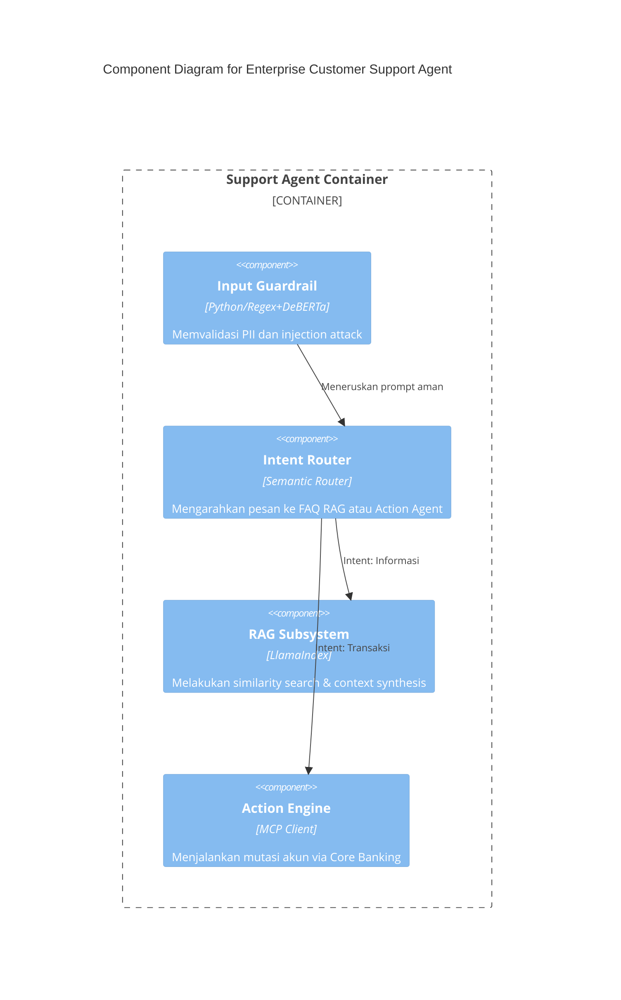

# Kurikulum Enterprise: Technical Writer (AI, Data, & Autonomous Agents)
## BAB 07: Prinsip Komunikasi Visual & Diagram C4 Model
### MODUL 02: Deep Dive, Implementasi Lanjutan & Arsitektur Produksi (Level 3 Component, Level 4 Code, Dynamic & Deployment Views)

---

### 1. Learning Objective

Setelah menyelesaikan modul ini, Staff/Principal Technical Writer dan Software Architect diharapkan mampu:
- Merancang dan memvalidasi artefak dokumentasi arsitektur tingkat lanjut menggunakan C4 Model (Level 3: Component, Level 4: Code, Dynamic Diagrams, dan Deployment Diagrams) untuk sistem AI terdistribusi dan sistem berbasis Autonomous Agent.
- Mengimplementasikan paradigma *Docs-as-Code* arsitektural menggunakan Structurizr DSL, Mermaid.js, dan PlantUML yang terintegrasi secara otomatis dalam pipeline CI/CD (GitHub Actions/GitLab CI).
- Menghubungkan abstraksi non-deterministik sistem AI (LLM Orchestrator, Vector Store, Memory Retrieval, Agentic Tool Use, Multi-Agent Communication Protocol) ke dalam representasi visual deterministik yang dapat diaudit oleh tim audit teknis dan engineering enterprise.
- Mengeliminasi divergensi visual (*architecture drift*) antara dokumen arsitektur dan basis kode riil melalui static analysis dan unit test arsitektur (ArchUnit/Tsit).

---

### 2. Prerequisite

Sebelum mempelajari modul ini, peserta wajib menguasai:
- **Konsep C4 Model Dasar**: Pemahaman Context (Level 1) dan Container (Level 2) dari Modul 01.
- **Sistem Agentik Modern**: Arsitektur Retrieval-Augmented Generation (RAG), Model Context Protocol (MCP), ReAct (Reasoning and Acting) loop, dan kerangka kerja orkestrasi (LangGraph, AutoGen, CrewAI, Semantic Kernel).
- **Tools & Sintaksis**: Git, CLI Linux, sintaksis Structurizr DSL, dan format serialisasi (JSON/YAML).
- **CI/CD Fundamentals**: GitHub Actions workflow syntax, Docker containerization.

---

### 3. Concept & Internal Architecture (Mendalam)

Implementasi C4 Model pada sistem AI dan Autonomous Agent membutuhkan penanganan khusus karena batasan struktural dan batas runtime (*runtime boundaries*) sering kali bergeser dari model deterministik konvensional ke model probabilistik.

```
+---------------------------------------------------------------------------------------+
|                                    C4 MODEL HIERARCHY                                 |
+---------------------------------------------------------------------------------------+
|  [L1] System Context  : Pengguna & Sistem Enterprise AI secara makro                  |
|         │                                                                             |
|         ▼                                                                             |
|  [L2] Container       : Runtime terisolasi (API Gateway, Vector DB, Agent Service)    |
|         │                                                                             |
|         ▼                                                                             |
|  [L3] Component       : Modul logis internal (Planner, Memory Manager, Tool Executor)  |
|         │                                                                             |
|         ▼                                                                             |
|  [L4] Code            : Desain kelas/antarmuka (OOP/Clean Arch) atau Dynamic Diagrams |
+---------------------------------------------------------------------------------------+
|  [Orthogonal Views]   : Deployment Architecture & Dynamic Execution Graphs             |
+---------------------------------------------------------------------------------------+
```

#### A. Level 3: Component Diagram untuk Autonomous Agent Container
Level 3 membedah sebuah *Container* (misalnya: `Autonomous Agent Worker Service`) menjadi *Component-Component* modular. Dalam sistem agen otonom, komponen internal tidak hanya sekadar *Controller*, *Service*, dan *Repository*, melainkan mengadopsi modul kognitif:
1. **Perception/Ingestion Component**: Mengurai *system prompt*, konteks obrolan, dan injeksi *few-shot*.
2. **Planner / Cognitive Engine Component**: Menjalankan ReAct loop, *Tree-of-Thought*, atau *Reflexion*.
3. **Short-Term / Working Memory Component**: Menyimpan konteks interaksi *in-memory* (Scratchpad/KV-cache pointer).
4. **Long-Term Memory Retriever Component**: Menangani komunikasi dua arah ke Container Vector DB melalui embedding search.
5. **Tool Registry & Invocation Component**: Mengelola integrasi protokol (misalnya: MCP - Model Context Protocol, OpenAPI plugins) dan mengeksekusi *sandboxed code execution*.

#### B. Dynamic Diagram: Menangkap Eksekusi Non-Deterministik
Dynamic Diagram pada C4 Model adalah padanan Sequence Diagram UML, tetapi terikat langsung pada Container dan Component C4 yang sudah didefinisikan. Diagram ini krusial untuk technical writer dalam mendokumentasikan interaksi runtime seperti:
- Resolusi *Tool-use loop* (LLM meminta eksekusi tool -> Executor mengeksekusi -> Hasil dikembalikan ke LLM).
- *Human-in-the-loop (HITL)* approval gate saat batas ambang kepercayaan (*confidence score threshold*) agen berada di bawah kriteria minimum.

#### C. Deployment Diagram: Pemetaan Runtime & Keamanan Produksi
Deployment diagram C4 memetakan artefak container fisik/virtual ke dalam node infrastruktur nyata. Untuk sistem enterprise autonomous agent, diagram ini harus memvisualisasikan:
- Boundary komputasi: VPC Private Subnet vs Public Subnet.
- Hardware Acceleration: CPU instance vs GPU inference cluster (misalnya: NVIDIA Triton Inference Server di EKS).
- Egress Policy: Network firewalls (Egress filtering) untuk mencegah LLM exfiltration attack ketika tool memanggil eksternal endpoint.

---

### 4. Why & What

| Dimensi | Pendekatan Tradisional (Diagram Tak Terstruktur) | Pendekatan C4 Model Lanjutan (Docs-as-Code) |
| :--- | :--- | :--- |
| **Bentuk Representasi** | Gambar statis (PNG/Draw.io) yang disimpan di Confluence/Wiki. | DSL terkontrol versi (Structurizr/Mermaid) disimpan bersama repositori kode. |
| **Abstraksi Agentic AI** | Sering kali disederhanakan sebagai "Black Box LLM" tunggal. | Terurai granular (Prompt Ingestion, Memory Bus, Tool Execution Layer, Guardrail Engine). |
| **Konsistensi Semantik** | Garis dan kotak bebas tanpa arti definitif (warna dan bentuk tidak baku). | Model relasional tunggal (*single source of truth*), rendering multi-sudut pandang. |
| **Audit & Governance** | Sulit dianalisis oleh auditor keamanan untuk kepatuhan (SOC2, ISO 42001). | Menampilkan batas trust boundary, data classification, enkripsi data in-transit/at-rest. |
| **Siklus Pembaruan** | Kadaluwarsa dalam 1-2 sprint seiring kode berkembang (*drift*). | Tervalidasi secara otomatis melalui linting dan pengujian arsitektur dalam CI/CD. |

---

### 5. How (Workflow Detail)

Alur kerja implementasi arsitektur Docs-as-Code untuk Technical Writer di lingkungan produksi:

```
[ Engineer/Tech Writer ]
          │
          │ 1. Tulis perubahan sistem dalam DSL
          ▼
[ Structurizr DSL (.dsl) ]
          │
          │ 2. Git Commit & Push
          ▼
[ GitHub / GitLab CI Pipeline ]
   ├── Step A: DSL Syntax Validation (Structurizr CLI validate)
   ├── Step B: Diagram Export (Export ke SVG / PlantUML / Mermaid)
   ├── Step C: Architecture Linting (Verifikasi isolasi layer)
   └── Step D: Automated Static Site Generation (MkDocs / Docusaurus)
          │
          │ 3. Deploy Artifacts
          ▼
[ Enterprise Internal Developer Portal / Architecture Hub ]
```

1. **Modeling Single Source of Truth**: Seluruh aktor, sistem, kontainer, komponen, dan deployment node didefinisikan hanya satu kali dalam file `.dsl`.
2. **Definisi Views**: Membuat variasi visual dari model dasar (View Component, Dynamic View untuk alur agen, dan View Deployment).
3. **Pipeline Assertion**: Menjalankan pengujian untuk memastikan setiap komponen baru memiliki atribut metadata wajib: `Technology`, `Description`, dan `Security Zone`.
4. **Automated Publishing**: Mengubah model tekstual menjadi diagram SVG interaktif beresolusi tinggi, diinjeksi ke dalam modul dokumentasi MkDocs Material atau Docusaurus.

---

### 6. Analogy & Diagram ASCII

#### Analogi
Bayangkan sistem operasi modern:
- **Level 1 (System Context)**: Pengguna melihat sebuah Personal Computer yang terhubung ke Internet dan Printer.
- **Level 2 (Container)**: Di dalam PC, terdapat OS Kernel, Browser, File System, dan Display Server.
- **Level 3 (Component)**: Membuka browser; kita menemukan *V8 JavaScript Engine*, *HTML Parser*, *Network Stack*, dan *Cookie Storage*.
- **Autonomous Agent Equivalence**:
  Agent bukanlah fungsi tunggal. Level 2 adalah *Agent Daemon Runtime*. Level 3 adalah *Prompt Parser*, *Context Window Truncator*, *Vector Search Subsystem*, dan *Sandbox Runtime*.

#### Diagram ASCII: Component View (Level 3) - Agent Orchestration Service

```
+---------------------------------------------------------------------------------------------------+
| Container: Agent Orchestration Engine (Python / FastAPI)                                          |
|                                                                                                   |
|     +-------------------------+                 +-------------------------------------------+     |
|     |  Prompt Guardrail       |                 |  Task Planner                             |     |
|     |  Component              |──(Sanitized)───>|  Component (ReAct Engine)                 |     |
|     |  [NeMo Guardrails]      |                 |  [LangGraph / Custom State Machine]       |     |
|     +-------------------------+                 +-------------------------------------------+     |
|                  ▲                                         │                     ▲                |
|                  │                                         ▼                     │                |
|           (Raw Ingestion)                       +--------------------+  (Tool Output/State)       |
|                  │                              | Execution Director |           │                |
|                  │                              +--------------------+           │                |
|                  │                                 │              │              │                |
|                  │                                 │              │              │                |
|     +-------------------------+                    │              ▼              │                |
|     |  Session State Manager  |                    │  +-----------------------+  │                |
|     |  Component              |<───────────────────+  | Tool Registry &       |──+                |
|     |  [Redis Client Wrapper] |                       | Dispatcher Component  |                   |
|     +-------------------------+                       | [MCP Client Protocol] |                   |
|                  │                                    +-----------------------+                   |
|                  ▼                                                │                               |
|        (Read/Write History)                          (Egress Network Request)                     |
+──────────────────┼────────────────────────────────────────────────┼───────────────────────────────+
                   │                                                │
                   ▼                                                ▼
     [External: Redis Cluster]                        [External: Enterprise API Gateway]
```

---

### 7. Simple Example & Practical Example

#### A. Simple Example (Mermaid.js - Component & Dynamic Sequence)
Diagram komponen sederhana menggunakan Mermaid untuk repositori README.



#### B. Practical Example (Enterprise Structurizr DSL)
File lengkap: `architecture/workspace.dsl`. Menampilkan model komprehensif: Level 3 Component, Dynamic Execution, dan Deployment Node.

```structurizr
workspace "Autonomous Financial Advisory Platform" "Arsitektur Produksi Agentic AI" {

    model {
        user = person "Nasabah Prioritas" "Pengguna akhir yang meminta nasihat portofolio investasi." "External User"
        
        enterpriseSystem = softwareSystem "Core Wealth Management Platform" "Sistem transaksional portofolio enterprise." {
            
            apiGateway = container "API Gateway" "Mengelola autentikasi mTLS, rate limiting, dan routing." "Kong Gateway" "Network Boundary"
            
            agentService = container "Autonomous Advisory Engine" "Mengatur orkestrasi reasoning, memory, dan eksekusi tool." "Python 3.11 / FastAPI" {
                guardrailComp = component "Safety & Policy Enforcer" "Menyaring jailbreak, PII leak, dan hallucination suppression." "NeMo Guardrails"
                plannerComp = component "Cognitive Planner" "Mengimplementasikan ReAct loop dan dekomposisi masalah." "LangGraph"
                memoryComp = component "Context & Memory Manager" "Mengelola rolling context window dan vector cache." "Custom Engine"
                toolDispatcher = component "MCP Tool Dispatcher" "Menjalankan tools eksternal melalui antarmuka aman." "Model Context Protocol Client"
            }
            
            vectorDb = container "Vector Knowledge Store" "Menyimpan embedding dokumen prospektus dan profil risiko nasabah." "Qdrant" "Database"
            llmGateway = container "Private LLM Inference Server" "Model fondasi enterprise lokal." "vLLM / Llama-3-70B-Instruct" "AI Engine"
            auditLog = container "Compliance Audit Store" "Immutable log untuk audit trail penalaran AI." "Amazon OpenSearch" "Database"
        }

        # Relasi System & Container
        user -> apiGateway "Mengirim instruksi via HTTPS/WSS"
        apiGateway -> guardrailComp "Meneruskan request terotentikasi"

        # Relasi Antar-Komponen di Level 3
        guardrailComp -> plannerComp "Mengirim prompt tervalidasi"
        plannerComp -> memoryComp "Membaca context & histori sesi"
        memoryComp -> vectorDb "Semantic search (similarity scoring)" "gRPC"
        plannerComp -> llmGateway "Mengirim formatted prompt & tool definition" "HTTP/POST"
        plannerComp -> toolDispatcher "Mendelegasikan pemanggilan fungsi" "In-Process Call"
        toolDispatcher -> apiGateway "Memanggil Core Banking API" "JSON/REST"
        plannerComp -> auditLog "Menyimpan full reasoning trace (COT & Tool Outputs)" "HTTPS/REST"

        # Deployment Model
        deploymentEnvironment "Production" {
            deploymentNode "AWS Cloud Infrastructure" "" "AWS VPC" {
                deploymentNode "Private EKS Cluster" "" "Kubernetes" {
                    deploymentNode "Compute Pod - Agent Worker" "" "Linux / EKS Node Group" {
                        agentInstance = containerInstance agentService
                    }
                    deploymentNode "GPU Accelerated Pod" "" "NVIDIA A100 80GB" {
                        llmInstance = containerInstance llmGateway
                    }
                }
                deploymentNode "Managed Database Subnet" "" "AWS Subnet" {
                    vdbInstance = containerInstance vectorDb
                    auditInstance = containerInstance auditLog
                }
            }
        }
    }

    views {
        component agentService "Components_AdvisoryEngine" {
            include *
            autoLayout lr
        }

        dynamic agentService "Dynamic_AdvisoryExecution" "Alur eksekusi penalaran investasi terstruktur" {
            user -> apiGateway "1. Mengirim permintaan alokasi portofolio"
            apiGateway -> guardrailComp "2. Forward request"
            guardrailComp -> plannerComp "3. Inisiasi reasoning plan"
            plannerComp -> memoryComp "4. Ambil histori portofolio nasabah"
            memoryComp -> vectorDb "5. Query top-k dokumen risiko"
            plannerComp -> llmGateway "6. Minta inferensi tool selection"
            llmGateway -> plannerComp "7. Return keputusan panggil API Core"
            plannerComp -> toolDispatcher "8. Eksekusi call tool"
            plannerComp -> auditLog "9. Catat seluruh audit reasoning log"
            autoLayout tb
        }

        deployment enterpriseSystem "Production" "Deployment_Production" {
            include *
            autoLayout tb
        }

        styles {
            element "Person" {
                shape Person
                background #08427b
                color #ffffff
            }
            element "Software System" {
                background #1168bd
                color #ffffff
            }
            element "Container" {
                background #438dd5
                color #ffffff
            }
            element "Component" {
                background #85bbf0
                color #000000
            }
            element "Database" {
                shape Cylinder
                background #2A52BE
                color #ffffff
            }
            element "AI Engine" {
                shape Pipe
                background #7B1FA2
                color #ffffff
            }
        }
    }
}
```

---

### 8. Real World Case Study (Enterprise Scale)

#### Konteks Sistem: "Global FinSec Agentic Fraud Investigation"
Institusi keuangan global mengoperasikan sistem *Autonomous Agent* yang bertugas menginvestigasi indikasi pencucian uang (*Anti-Money Laundering / AML*). Sistem menerima peringatan transaksi mencurigakan, mengumpulkan berkas lintas sistem, memproses bukti berbasis LLM, dan merekomendasikan pembekuan rekening.

#### Permasalahan Arsitektur & Dokumentasi:
1. **Audibilitas**: Regulator menuntut bukti visual mengenai batas keamanan (*Trust Boundaries*). Di mana data nasabah di-masking sebelum masuk ke LLM?
2. **Architecture Drift**: Tim engineer kerap menambahkan *Tool/Plugin* baru ke agen tanpa mencatat interaksi dependensi, menyebabkan kegagalan sistem downstream karena overload API.
3. **Dokumentasi Terfragmentasi**: Diagram arsitektur tersebar di Miro, Visio, dan Confluence tanpa relasi yang sinkron.

#### Solusi yang Diterapkan:
1. **Sentralisasi C4 Docs-as-Code**: Seluruh sistem dimodelkan dengan Structurizr DSL di dalam monorepo platform.
2. **Komponen Level 3 Diperketat**: Membedah container *Fraud Investigator Worker* menjadi komponen terisolasi: `Transaction Graph Scraper`, `PII Anonymization Filter`, `Autonomous Hypothesis Generator`, dan `SAR (Suspicious Activity Report) Compiler`.
3. **Penerapan Dynamic View Terstandarisasi**: Setiap penambahan alur investigasi baru harus menyertakan C4 Dynamic Diagram yang memperlihatkan *fallback path* jika LLM berhalusinasi atau API target menolak permintaan (*circuit broken*).
4. **CI/CD Enforcement**: Pipeline menolak Pull Request jika ada tool baru di kode Python yang belum didefinisikan pada komponen Level 3 di file DSL.

#### Hasil Terukur:
- Waktu audit kepatuhan ISO/IEC 42001 & SOC2 terpangkas dari **6 minggu menjadi 4 hari**.
- Zero documentation-drift: Diagram dalam portal dokumentasi developer ter-render ulang secara otomatis dalam hitungan menit setiap kali PR di-merge ke branch `main`.

---

### 9. Trade-offs

```
                       DOKUMENTASI STATIS (VISIO/MIRO)
                                     ▲
                                    / \
                                   /   \
  Kebebasan Visual Tanpa Batas    /     \   Tinggi Biaya Sinkronisasi
  (High Custom Styling)          /       \  (High Architecture Drift)
                                /         \
                               /           \
                              ▼─────────────▼
                       DOCS-AS-CODE (STRUCTURIZR/C4)
    Tinggi Konsistensi Semantik      Keterbatasan Fleksibilitas Layout Bebas
    (Strict Semantic Architecture)    (Deterministic Auto-Layouting)
```

| Aspek | Pendekatan Terbuka / Gambar Bebas (Miro / Lucidchart) | Pendekatan Docs-as-Code C4 (Structurizr DSL / CLI) |
| :--- | :--- | :--- |
| **Effort Pemeliharaan** | **Tinggi**: Gambar harus diperbarui manual satu per satu saat kode berubah. | **Rendah**: Cukup perbarui satu elemen relasi model, semua diagram turunannya otomatis terupdate. |
| **Kontrol Tampilan (Styling)** | **Sangat Fleksibel**: Bebas meletakkan kotak dan garis di mana saja secara manual. | **Kaku**: Bersandar pada algoritma *auto-layout* (Graphviz/Dagre). Penataan mikro sulit dilakukan. |
| **Audit Versioning** | **Buruk**: Format biner atau JSON blob non-diffable yang tidak terbaca pada Git diff. | **Sangat Baik**: Berbasis teks murni; perubahan dapat ditinjau baris per baris melalui Git Pull Request. |
| **Skalabilitas Model** | **Rendah**: Redundansi penggambaran komponen berulang di banyak halaman. | **Sangat Tinggi**: Paradigma DRY (*Don't Repeat Yourself*); definisikan entitas sekali, render di N views. |

---

### 10. Common Mistakes & Troubleshooting

#### Mistake 1: Merancukan Component Diagram (Level 3) dengan Class Diagram (Level 4)
* **Gejala**: Technical writer mendokumentasikan setiap class, interface, method, dan helper utility ke dalam diagram Level 3.
* **Dampak**: Diagram menjadi tidak terbaca (*cognitive overload*) dan runtuh setiap kali refaktorisasi internal minor dilakukan.
* **Solusi**: Batasi komponen Level 3 hanya pada modul kompilasi atau unit struktural runtime mandiri (misal: modul yang dibungkus oleh Dependency Injection container). Gunakan Level 4 secara selektif hanya untuk logika algoritma yang sangat kompleks.

#### Mistake 2: Menghilangkan Komponen Non-Deterministik pada Arsitektur Agent
* **Gejala**: Mengabaikan guardrail, semantic memory cache, dan tokenizer limiter, lalu menyatukannya langsung sebagai "Komponen AI Service".
* **Dampak**: Tim audit keamanan dan reliabilitas tidak dapat mengidentifikasi mitigasi terhadap kerentanan OWASP Top 10 for LLM (seperti *Prompt Injection* dan *Insecure Output Handling*).
* **Solusi**: Dokumentasikan `Guardrail Validator` dan `Execution Sandbox` secara eksplisit sebagai komponen independen di Level 3 dengan boundary trust yang jelas.

#### Mistake 3: Menumpuk Seluruh Skenario Runtime dalam Satu Dynamic Diagram
* **Gejala**: Membuat satu dynamic diagram yang berisi alur normal, error rate limit, failover model, human-in-the-loop, dan network retry.
* **Dampak**: Diagram menjadi spageti dan membingungkan pembaca.
* **Solusi**: Pecah menjadi beberapa Dynamic Views spesifik berdasarkan *User Journey* atau *Use Case* (misal: `Dynamic_NormalInvestigationPath`, `Dynamic_FallbackOnLLMTimeout`).

#### Troubleshooting Panduan DSL Syntax Error
Saat menjalankan `structurizr-cli validate`:
* **Error**: `Relationship destination ... does not exist in model`.
  * *Root Cause*: Mencoba membuat relasi ke komponen yang dideklarasikan di dalam kontainer yang tidak berada dalam scope model yang aktif.
  * *Fix*: Pastikan identifier target sudah didefinisikan sebelum baris relasi dibuat, atau gunakan fully-qualified identifier.

---

### 11. Best Practices (Production Checklist)

Gunakan checklist ini sebelum mempublikasikan diagram C4 untuk sistem enterprise:

- [ ] **Level Check**: Diagram Level 3 hanya menampilkan komponen di dalam *satu* Container target (tidak mencampur aduk internal komponen dari dua container berbeda sekaligus).
- [ ] **Explicit Technology Stacks**: Setiap komponen wajib mencantumkan teknologi dan framework spesifik (contoh: bukan "Python", tetapi "Python 3.11, LangGraph, Pydantic v2").
- [ ] **Clear Direction of Relationships**: Panah relasi mendeskripsikan tujuan data atau aksi, bukan sekadar kata "menggunakan" atau "berkomunikasi" (contoh: "Mengirim sanitized prompt via gRPC").
- [ ] **Trust Boundary Isolation**: Terdapat penandaan visual yang membedakan zona jaringan (misal: `DMZ Subnet`, `PCI-DSS Subnet`, `External Public Cloud API`).
- [ ] **Docs-as-Code Pipeline Health**: Berkas `.dsl` berhasil divalidasi oleh `structurizr-cli validate` tanpa warning.
- [ ] **Automated Export Consistency**: Ekspor format SVG atau PNG dalam pipeline selalu di-push ke storage artefak dokumentasi secara deterministik tanpa intervensi manual.
- [ ] **Orphan Element Auditing**: Tidak ada komponen atau relasi yang terisolasi sendiri tanpa koneksi logis ke alur komputasi utama.

---

### 12. Hands-on Practice

Buat struktur repositori dan otomatisasi validasi arsitektur lokal pada folder: `hands-on/m02/`.

#### Langkah 1: Siapkan Struktur Direktori
```bash
mkdir -p hands-on/m02/architecture hands-on/m02/scripts hands-on/m02/.github/workflows
cd hands-on/m02
```

#### Langkah 2: Buat Berkas `architecture/system.dsl`
```structurizr
workspace "Agentic RAG Engine" "Arsitektur Produksi Sistem Autonomous QA" {

    model {
        developer = person "Software Engineer" "Pengguna internal dokumentasi teknis."
        
        ragSystem = softwareSystem "Autonomous RAG Platform" "Menyediakan layanan inferensi kode pintar." {
            ragContainer = container "Retrieval Orchestration Worker" "Memproses context augmentation dan inference." "Python / FastAPI" {
                sanitizer = component "Prompt Sanitizer" "Membersihkan input string dan token PII." "Pydantic"
                retriever = component "Vector Retriever" "Menjalankan dense & sparse search." "Qdrant Client"
                agentBrain = component "Agentic Reasoner" "Mengeksekusi reasoning loop & function calling." "LangGraph"
            }
            vectorStore = container "Vector Database" "Penyimpanan koleksi embedding." "Qdrant" "Database"
        }

        developer -> ragContainer "Mengirim instruksi via REST"
        sanitizer -> agentBrain "Meneruskan input yang telah divalidasi"
        agentBrain -> retriever "Meminta grounding data kode"
        retriever -> vectorStore "Query similarity embedding" "gRPC"
    }

    views {
        component ragContainer "C4_L3_RAG_Worker" {
            include *
            autoLayout lr
        }
    }
}
```

#### Langkah 3: Buat Skrip Otomatisasi Validasi (`scripts/validate_architecture.sh`)
```bash
#!/usr/bin/env bash
set -euo pipefail

echo "=========================================="
echo "Memulai Validasi Arsitektur Docs-as-Code"
echo "=========================================="

STRUCTURIZR_VERSION="v2024.12.07"
DSL_FILE="architecture/system.dsl"

# Menjalankan validasi via Docker container resmi
docker run --rm -v "$(pwd)/architecture:/usr/local/structurizr" \
    structurizr/cli:latest \
    validate -w /usr/local/structurizr/system.dsl

echo ">> Validasi Syntax Structurizr DSL: BERHASIL"

# Ekspor diagram ke format Mermaid untuk verifikasi integrasi markdown
docker run --rm -v "$(pwd)/architecture:/usr/local/structurizr" \
    structurizr/cli:latest \
    export -w /usr/local/structurizr/system.dsl -format mermaid

echo ">> Ekspor Mermaid: BERHASIL"
echo "=========================================="
echo "Seluruh artefak visual lolos pengujian arsitektur!"
```

#### Langkah 4: Buat GitHub Actions Workflow (`.github/workflows/arch-lint.yml`)
```yaml
name: Architecture Docs-as-Code CI

on:
  push:
    paths:
      - 'hands-on/m02/architecture/**'
  pull_request:
    paths:
      - 'hands-on/m02/architecture/**'

jobs:
  validate-architecture:
    runs-on: ubuntu-latest
    steps:
      - name: Checkout Repository
        uses: actions/checkout@v4

      - name: Run Architecture Validation & Lint
        run: |
          cd hands-on/m02
          chmod +x scripts/validate_architecture.sh
          ./scripts/validate_architecture.sh

      - name: Archive Generated Diagrams
        uses: actions/upload-artifact@v4
        with:
          name: architecture-diagrams
          path: hands-on/m02/architecture/*.mmd
```

---

### 13. Exercise

#### Level: Easy
1. Tambahkan sebuah komponen baru bernama `Cache Manager` (berbasis `Redis Client`) ke dalam container `Retrieval Orchestration Worker` pada file `system.dsl`.
2. Hubungkan `agentBrain` ke `Cache Manager` untuk membaca hasil respons reasoning yang pernah dihitung sebelumnya.

#### Level: Medium
1. Perluas `system.dsl` dengan menambahkan **Dynamic View** yang mendeskripsikan secara eksplisit skenario saat cache miss terjadi:
   - Request masuk -> Sanitizer -> Agentic Reasoner -> Cache Manager (Miss) -> Retriever -> Vector Database -> Kembalikan respon ke developer -> Simpan respon di Cache Manager.

#### Level: Hard
1. Buat **Deployment View** baru di dalam file `system.dsl` yang memetakan container ke node infrastruktur multi-region (Region Primary: AWS `ap-southeast-1` dan Disaster Recovery: AWS `ap-southeast-3`).
2. Terapkan deployment node yang memiliki cluster Vector Database tersinkronisasi secara asynchronous antar-region.
3. Tambahkan assertions/tags khusus untuk menandai komponen yang memproses data berklasifikasi *Confidential*.

---

### 14. Challenge

**Studi Kasus**: Rancang Dokumentasi Visual Arsitektur Sistem "Autonomous Multi-Agent Swarm for Cybersecurity Incident Response"
* **Kebutuhan Sistem**:
  Sistem terdiri dari 3 agen otonom utama yang saling berkolaborasi:
  1. *Triage Agent*: Menerima Syslog enterprise dan memilah alert.
  2. *Investigation Agent*: Mengeksekusi sandbox analysis, reverse engineering metadata, dan querying threat intelligence (MISP/VirusTotal).
  3. *Remediation Agent*: Memiliki izin eksekusi untuk mengubah rule AWS Security Group dan mengisolasi host di Kubernetes.
* **Tantangan Arsitektur & Dokumentasi**:
  1. Buat Structurizr DSL lengkap yang membedah sistem hingga **Level 3 (Component)** untuk *Remediation Agent*, menyoroti mekanisme **Human Approval Safety Interlock Gate** (di mana aksi pembekuan aset server di atas level *Criticality Tier-1* harus menunggu persetujuan human engineer via Slack/Teams webhook).
  2. Susun **Dynamic View** spesifik yang mendokumentasikan skenario kegagalan: Apa yang terjadi jika *Remediation Agent* kehilangan koneksi ke Cloud API saat proses isolasi host sedang berjalan separuh jalan?
  3. Tuliskan file DSL tanpa error sintaksis, pastikan menerapkan pemisahan kontainer, komponen, boundaries, tags, dan styles representatif tingkat enterprise.

---

### 15. Quiz Evaluasi Pemahaman

#### A. Pertanyaan Basic (Pilihan Ganda)

1. Apa batasan granularitas yang tepat untuk diagram C4 Level 3 (Component)?
   - A. Menampilkan setiap baris fungsi dan method internal.
   - B. Menampilkan modul logis, controller, atau engine yang berjalan di dalam batas satu kontainer.
   - C. Menampilkan seluruh server fisik dan kabel jaringan di data center.
   - D. Menampilkan interaksi makro antar-departemen organisasi.

2. Mengapa format biner diagram konvensional (misalnya `.vsdx` atau `.drawio` non-text) tidak dianjurkan dalam standar Docs-as-Code modern?
   - A. Karena tidak dapat dibuka di sistem operasi selain Windows.
   - B. Karena tidak memungkinkan dilakukannya *version control diffing*, automasi pengujian linting, dan *code review* via Pull Request.
   - C. Karena format tersebut selalu menghasilkan diagram yang memiliki resolusi buram.
   - D. Karena format biner tidak didukung oleh browser web modern apa pun.

3. Komponen manakah yang paling esensial dimodelkan pada Level 3 untuk sebuah Autonomous Agent guna mencegah serangan *Direct Prompt Injection*?
   - A. Task Decomposition Engine
   - B. Input Guardrail / Safety Policy Enforcer
   - C. Vector Similarity Metric Calculator
   - D. Output Streaming Buffer

4. Apa perbedaan mendasar antara Sequence Diagram standar UML dan Dynamic Diagram pada C4 Model?
   - A. UML Sequence diagram tidak memiliki urutan waktu, sedangkan C4 Dynamic memilikinya.
   - B. C4 Dynamic Diagram terikat langsung pada elemen model terdefinisi (Software System, Container, Component) dan menggunakan model relasi terpadu.
   - C. C4 Dynamic Diagram hanya boleh digunakan untuk perangkat keras jaringan.
   - D. C4 Dynamic Diagram tidak dapat di-render menggunakan tool tekstual.

5. Manakah target utama dari diagram Level 4 (Code Diagram) dalam arsitektur C4?
   - A. Seluruh sistem enterprise secara menyeluruh dari hulu ke hilir.
   - B. Bagian kelas atau dependensi antarmuka mikro yang memiliki kompleksitas arsitektural sangat tinggi atau resiko kritis.
   - C. Hanya skema database relasional (Entity Relationship Diagram).
   - D. Infrastruktur cloud multi-region.

#### B. Pertanyaan Intermediate (Pilihan Ganda & Analisis Pendek)

6. Dalam Structurizr DSL, apa kata kunci yang digunakan untuk mengelompokkan beberapa deployment node ke dalam satu isolasi jaringan privat virtual?
   - A. `subsystemBoundary`
   - B. `networkZone`
   - C. `deploymentNode`
   - D. `infrastructureCluster`

7. Anda bertugas mendokumentasikan sistem AI Agent yang menggunakan *Model Context Protocol (MCP)*. Pada level C4 manakah MCP Server dan MCP Client paling tepat dimodelkan ketika keduanya berjalan pada pod terpisah?
   - A. Level 1 (System Context)
   - B. Level 2 (Container)
   - C. Level 3 (Component)
   - D. Level 4 (Code)

8. Sebuah pipeline CI/CD dokumentasi mengalami kegagalan saat mengeksekusi `structurizr-cli export`. Log menunjukkan error: `Dangling relationship found`. Apa artinya?
   - A. Ada relasi yang diarahkan ke elemen yang telah dihapus atau tidak terdaftar dalam model workspace.
   - B. Diagram kekurangan deklarasi warna tema.
   - C. Ukuran berkas teks DSL melebihi batas 1 megabyte.
   - D. Lisensi komersial Structurizr telah kedaluwarsa.

9. Manakah cara paling efektif untuk mengotomasi deteksi *architecture drift* antara kode Python (misal: LangGraph agent) dan model C4 Level 3?
   - A. Mewajibkan developer menggambar diagram di kertas setiap sprint planning.
   - B. Menggunakan test runner (seperti PyTest) yang membaca struktur modul kode dan memvalidasinya terhadap dump model C4 JSON melalui static analysis AST (Abstract Syntax Tree).
   - C. Menghapus diagram C4 secara periodik dan membuatnya ulang dari nol.
   - D. Mengunci repositori agar developer tidak bisa mengubah implementasi kode.

10. Ketika mendokumentasikan arsitektur agentic AI, di manakah tempat terbaik untuk memvisualisasikan batas kuota token dan rate-limit pihak ketiga (misal: OpenAI/Anthropic API)?
    - A. C4 Level 1 saja.
    - B. Pada properti/metadata relasi antara Container/Component pemanggil dan Software System eksternal di DSL.
    - C. Tidak perlu didokumentasikan karena merupakan ranah vendor pihak ketiga.
    - D. Di dalam footer lisensi file teks.

#### C. Skenario Kasus Produksi

11. **Skenario 1**: Tim compliance keamanan perbankan meminta Anda menunjukkan jalur aliran data PII (Personally Identifiable Information) saat nasabah berinteraksi dengan AI Financial Coach. Jelaskan artefak C4 Model apa saja yang harus Anda sajikan, view apa yang digunakan, dan bagaimana Anda menandai data sensitif tersebut dalam Structurizr DSL!
12. **Skenario 2**: Autonomous Agent Anda mengalami insiden di produksi: Agent mengalami *infinite loop* dalam pemanggilan tool eksternal yang membengkakkan tagihan API hingga $10,000 dalam 1 jam. Tim engineer telah memasang *Loop Breaker Circuit Component*. Bagaimana Anda memperbarui diagram Level 3 dan Dynamic View untuk mengomunikasikan mekanisme proteksi ini kepada CTO dan lead engineer?
13. **Skenario 3**: Sebuah platform multi-agent berbasis microservices diubah dari synchronous REST calls menjadi event-driven streaming menggunakan Apache Kafka. Bagaimana perubahan ini direfleksikan pada diagram C4 Level 2 (Container), Level 3 (Component), dan deployment views-nya agar tim SRE memahami trust boundary dan latency overhead-nya?

---

### Kunci Jawaban Quiz

#### A. Basic
1. **B**: Level 3 membedah internal satu kontainer menjadi komponen modul logis runtime.
2. **B**: Keunggulan Docs-as-Code adalah transparansi pelacakan versi, auditability Git diff, dan interoperabilitas pipeline otomatis.
3. **B**: Input Guardrail adalah komponen krusial yang bertugas memvalidasi, menepis, dan membersihkan prompt sebelum dikonsumsi oleh model kognitif.
4. **B**: Dynamic Diagram pada C4 terintegrasi erat dengan model relasional entitas C4 dan bukan sekadar gambar sequence garis waktu generik.
5. **B**: Level 4 tidak ditujukan untuk seluruh basis kode, melainkan hanya kelas/antarmuka kritis yang membutuhkan penjelasan arsitektural mendalam.

#### B. Intermediate
6. **C**: `deploymentNode` digunakan secara bersarang (*nested*) untuk merepresentasikan host, VPC, subnet, atau cluster.
7. **B**: Karena MCP Server dan MCP Client berjalan pada pod/proses terpisah di jaringan yang berbeda, keduanya dikategorikan sebagai *Container*.
8. **A**: Error `Dangling relationship` terjadi ketika target source atau destination dari suatu relasi panah tidak dapat diresolusi oleh parser DSL.
9. **B**: Menjalankan static analysis assertion (AST) terhadap kode produksi dibandingkan model C4 JSON adalah pola eliminasi drift mutakhir.
10. **B**: Menempatkan metadata atribut/deskripsi pada panah relasi memberikan konteks teknis yang tepat tanpa mengotori simplisitas diagram.

#### C. Panduan Penilaian Skenario Kasus Produksi
11. **Skenario 1**: Technical writer harus menyajikan:
    - *Component View (Level 3)* dari Orchestrator Container, memperlihatkan `PII Anonymizer Component`.
    - *Dynamic View*, memperlihatkan urutan langkah: Input -> Anonymizer Component (data tokenized) -> LLM Engine (hanya menerima anon-token) -> Output De-anonymizer.
    - *Structurizr DSL*: Menambahkan tag `PII Boundary` dengan `styles` warna merah khusus pada elemen terkait.
12. **Skenario 2**: 
    - Tambahkan komponen `Loop Breaker / Iteration Limiter` di Level 3 di antara `Cognitive Planner` dan `Tool Dispatcher`.
    - Di Dynamic View, gambarkan kondisi percabangan (*conditional dynamic step*): Jika `Iteration Count > Max Allowed (e.g., 5)`, komponen memutus siklus eksekusi, memicu status alert, dan langsung merutekan fallback error response ke pengguna.
13. **Skenario 3**:
    - *Level 2*: Tambahkan container `Event Broker (Apache Kafka)` sebagai perantara pub/sub. Relasi diubah dari `HTTP/REST (Synchronous)` menjadi `Publish/Subscribe Event (Asynchronous via Kafka Protocol)`.
    - *Level 3*: Tambahkan `Event Producer Component` pada agen pengirim dan `Event Consumer / Idempotent Listener Component` pada agen penerima.
    - *Deployment View*: Tampilkan Kafka broker node di dalam private data subnet lengkap dengan storage persistent volume (EBS) untuk mitigasi data loss bagi tim SRE.

---

### 16. Summary

Implementasi lanjutan C4 Model untuk Technical Writer di era Autonomous Agent dan Data Systems mengubah peran dokumentasi dari sekadar pencatatan pasif menjadi fondasi rekayasa sistem yang aktif (*executable architecture*):
1. **Dekomposisi Kognitif Granular**: Mengurai kotak hitam sistem AI menjadi komponen Level 3 yang jelas (Guardrails, Planners, Memory Hubs, Tool Interfaces) memungkinkan verifikasi arsitektur yang aman dan patuh regulasi.
2. **Kekuatan Dynamic View**: Menjadi instrumen utama dalam mendokumentasikan sifat non-deterministik sistem agen (reasoning loop, decision trees, serta mitigasi kegagalan runtime).
3. **Docs-as-Code & Single Source of Truth**: Melalui Structurizr DSL dan otomatisasi CI/CD, dokumentasi arsitektur tidak lagi mengalami degradasi relevansi (*architecture drift*), melainkan terus teruji seiring setiap baris kode berkembang menuju skala produksi enterprise.